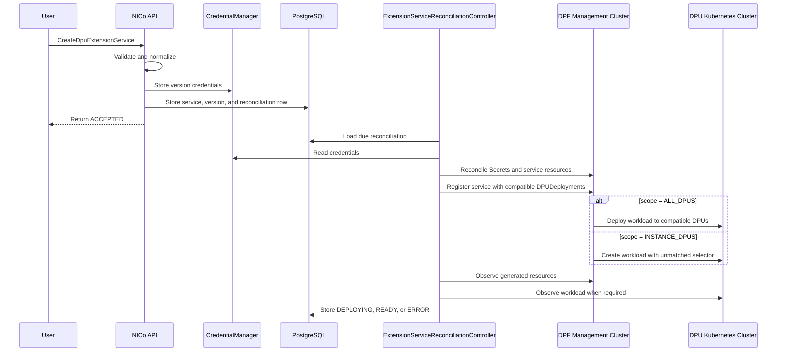

# DPU Extension Service Integration with DPF

GitHub Issue: [#3103](https://github.com/NVIDIA/infra-controller/issues/3103)

## 1. Revision History

| Version |    Date    | Modified By | Description     |
| :-----: | :--------: | :---------- | :-------------- |
|   0.1   | 07/01/2026 | Felicity Xu | Initial version |

## 2. Summary

NICo currently supports DPU Extension Services of type `KUBERNETES_POD`. A `KUBERNETES_POD` service is attached to an instance, delivered to the instance's DPUs through `GetManagedHostNetworkConfig`, and deployed locally by the DPU agent as a static Kubernetes Pod.

As NICo moves to DPF, extension services should use DPF instead of being deployed directly by the DPU agent. This design introduces `DPF_HELM_CHART` for versioned Helm services managed through DPF.

A user creates a `DPF_HELM_CHART` service version with a Helm chart reference, values, and required credentials. The NICo Site Controller converts it into DPF resources, registers the service with `DPUDeployment` objects, and monitors deployment status.

The feature is delivered in two stages:
- **Stage 1 — `ALL_DPUS`:** the service is deployed to every DPU in each compatible `DPUDeployment`.
- **Stage 2 — `INSTANCE_DPUS`:** the service is attached to an instance and deployed only to the DPUs used by that instance.

Stage 1 is implemented first. Stage 2 depends on the "Propagating labels from `DPUDevice` to the corresponding `v1.node` object" feature from DPF team. Until that dependency is available, `INSTANCE_DPUS` service creation should be rejected.

Existing `KUBERNETES_POD` behavior remains unchanged.

## 3. API Model

### 3.1 Overall Changes

The existing DPU Extension Service APIs are reused for `DPF_HELM_CHART`.

The main API changes are:
- add the `DPF_HELM_CHART` service type;
- add an immutable deployment scope field for `DPF_HELM_CHART`;
- retain the existing `data` field, but tenants need to provide a different, Helm-specific data format when creating a `DPF_HELM_CHART` version;
- support multiple purpose-qualified credentials for each Helm service version; and
- add asynchronous deployment status to service-version responses.

```proto
message CreateDpuExtensionServiceRequest {
  optional string service_id = 1;
  string service_name = 2;
  optional string description = 3;
  DpuExtensionServiceType service_type = 4;
  string tenant_organization_id = 5;

  // Immutable, service-type-specific specification for the initial version.
  string data = 6;

  // KUBERNETES_POD only.
  optional DpuExtensionServiceCredential credential = 7;

  optional DpuExtensionServiceObservability observability = 8;

  // DPF_HELM_CHART only.
  repeated DpuExtensionServiceCredential dpf_helm_chart_credentials = 9;

  // DPF_HELM_CHART only.
  DpuExtensionServiceDeploymentScope deployment_scope = 10; // Defaults to ALL_DPUS.
}

message UpdateDpuExtensionServiceRequest {
  string service_id = 1;

  optional string service_name = 2;
  optional string description = 3;

  // Creates a new immutable service version.
  string data = 4;

  // KUBERNETES_POD only.
  optional DpuExtensionServiceCredential credential = 5;

  optional int32 if_version_ctr_match = 6;

  optional DpuExtensionServiceObservability observability = 7;

  // DPF_HELM_CHART only.
  repeated DpuExtensionServiceCredential dpf_helm_chart_credentials = 8;
}

message DpuExtensionService {
  // Existing fields unchanged.

  // Present only for DPF_HELM_CHART.
  optional DpuExtensionServiceDeploymentScope deployment_scope = 11;
}

message DpuExtensionServiceVersionInfo {
  // Existing fields unchanged.

  // Present only for DPF_HELM_CHART.
  optional DpuExtensionServiceVersionDeploymentStatus deployment_status = 6;
}
```

`deployment_scope` is not included in `UpdateDpuExtensionServiceRequest` because it is immutable at the service level. Updating `data` or credentials creates a new immutable version with the same service type and deployment scope.

### 3.2 Service Type

Add a new extension service type:

```proto
enum DpuExtensionServiceType {
  KUBERNETES_POD = 0;
  DPF_HELM_CHART = 1;
}
```

The service type is immutable and determines how the workload is deployed and reconciled:
- `KUBERNETES_POD` is delivered to the DPU and managed locally by the DPU agent through kubelet. This behavior is unchanged.
- `DPF_HELM_CHART` is reconciled through DPF by the `ExtensionServiceReconciliationController`.

### 3.3 Deployment Scope

Add `deployment_scope` to `CreateDpuExtensionServiceRequest` to describe where a `DPF_HELM_CHART` service runs.

```proto
enum DpuExtensionServiceDeploymentScope {
  ALL_DPUS = 0;
  INSTANCE_DPUS = 1;
}
```

Deployment scope applies only to `DPF_HELM_CHART`. For `KUBERNETES_POD`, the default zero value is ignored; existing instance configuration still determines deployment.

For `DPF_HELM_CHART`, omission defaults to `ALL_DPUS`. The value is stored on the parent service and shared by all versions. There is no `UNSPECIFIED` value.

Deployment scope cannot be changed by an update. A tenant that requires a different scope must create a new extension service.

#### 3.3.1 `ALL_DPUS`

`ALL_DPUS` is supported in Stage 1. When a service version is created, NICo adds it to every compatible shared `DPUDeployment`. DPF then deploys the workload to all DPUs selected by those deployments.

An `ALL_DPUS` service:
- is deployed automatically to all DPUs in every compatible `DPUDeployment` after creation;
- is not attached to an instance;
- must not be included in an instance's extension service configuration;
- is rejected if referenced through `updateInstance`; and
- reports deployment state at the service-version level.

#### 3.3.2 `INSTANCE_DPUS`

`INSTANCE_DPUS` is supported in Stage 2 as it requires the "Propagating labels from `DPUDevice` to the corresponding `v1.node` object" feature from DPF team. When a service version is created, NICo registers it with every compatible shared `DPUDeployment`, but injects a generated Node selector that initially matches no DPU. The version can therefore become ready for attachment without running a workload.

When an instance references the version through `updateInstance`, NICo:

1. determines which DPUs are selected by the instance;
2. adds a generated label to the corresponding `DPUDevice` resources;
3. waits for DPF to propagate the label to the corresponding Kubernetes Nodes; and
4. observes the workload running on those Nodes.

The workload runs only on DPUs selected by instances that reference that exact service version.

`INSTANCE_DPUS` is accepted only after the site's Stage 2 capability is enabled. Until the required DPF Node-label propagation feature is available and configured, creation requests using this scope are rejected.

### 3.4 Data: Helm Chart and Values

The existing `data` field remains the immutable, service-type-specific payload for each extension service version.

For `DPF_HELM_CHART`, tenants must provide `data` as a JSON object describing the Helm chart and values.

```json
{
  "repoURL": "oci://registry.example.com/charts",
  "chart": "tenant-service",
  "chartVersion": "1.2.3",
  "deploymentTypes": [
    "BF3"
  ],
  "imageRegistries": [
    "registry.example.com"
  ],
  "values": {
    "image": {
      "repository": "registry.example.com/tenant/service",
      "tag": "1.2.3"
    },
    "service": {
      "logLevel": "info"
    }
  }
}
```

| Field             | Required | Description                                             |
| ----------------- | -------- | ------------------------------------------------------- |
| `repoURL`         | Yes      | Approved HTTPS or OCI Helm repository URL.              |
| `chart`           | Yes      | Qualified chart name.                                   |
| `chartVersion`    | Yes      | Exact pinned chart version.                             |
| `deploymentTypes` | Yes      | DPU deployment types supported by this version.         |
| `imageRegistries` | No       | Image registries for which credentials may be supplied. |
| `values`          | No       | Immutable chart-specific Helm values.                   |

The API parses, validates, normalizes, and stores this JSON. Unknown top-level fields are rejected.

`repoURL`, `chart`, and `chartVersion` are mapped into `DPUServiceTemplate.spec.helmChart.source`. Tenant-provided `values` form the base of `DPUServiceTemplate.spec.helmChart.values`.

NICo generates and owns values required for deployment and resource management, including:

* DPF resource names;
* Helm release name;
* `deploymentServiceName`;
* ownership labels;
* image pull Secret names;
* the Stage 2 `INSTANCE_DPUS` Node selector; and
* `upgradePolicy.applyNodeEffect`.

Tenant-provided values must not override NICo-owned fields. Reserved paths include:
```text
additionalNodeSelector
imagePullSecrets
```

The complete reserved path list is defined by the [qualified chart contract in Appendix A](#appendix-a).

### 3.5 Credentials

The existing singular `credential` field remains specific to `KUBERNETES_POD`.

A `DPF_HELM_CHART` version may require more than one credential:
- one credential for accessing the Helm chart repository; and
- zero or more credentials for pulling container images.

```proto
enum DpuExtensionServiceCredentialPurpose {
  DPU_EXTENSION_SERVICE_CREDENTIAL_PURPOSE_UNSPECIFIED = 0;
  DPU_EXTENSION_SERVICE_CREDENTIAL_PURPOSE_IMAGE_REGISTRY = 1;
  DPU_EXTENSION_SERVICE_CREDENTIAL_PURPOSE_CHART_REPOSITORY = 2;
}

message DpuExtensionServiceCredential {
  string registry_url = 1;

  oneof type {
    UsernamePassword username_password = 2;
  }

  DpuExtensionServiceCredentialPurpose purpose = 3;
}
```

Credentials are stored through `CredentialManager` and are write-only. Read APIs only report whether credentials exist for a version.
```text
machines/extension-services/<service-id>/versions/<version>/chart-repository
machines/extension-services/<service-id>/versions/<version>/image-registries/<sha256-registry-url>
```

### 3.6 Version Deployment Status

A successful create or update response means that NICo validated and stored the version. It does not mean that DPF resources or workloads are ready.

```proto
enum DpuExtensionServiceVersionDeploymentState {
  DPU_EXTENSION_SERVICE_VERSION_DEPLOYMENT_UNSPECIFIED = 0;
  DPU_EXTENSION_SERVICE_VERSION_ACCEPTED = 1;
  DPU_EXTENSION_SERVICE_VERSION_DEPLOYING = 2;
  DPU_EXTENSION_SERVICE_VERSION_READY = 3;
  DPU_EXTENSION_SERVICE_VERSION_ERROR = 4;
  DPU_EXTENSION_SERVICE_VERSION_DELETING = 5;
}

message DpuExtensionServiceVersionDeploymentStatus {
  DpuExtensionServiceVersionDeploymentState state = 1;
  string message = 2;
}
```

The status is populated only for `DPF_HELM_CHART`.

- For `ALL_DPUS`, `READY` means the service has been deployed through every compatible `DPUDeployment` and the required workload readiness conditions are satisfied.
- For `INSTANCE_DPUS`, `READY` means the reusable service has been registered and is available for attachment. It does not mean that a workload is already running on a DPU.

### 3.7 Request Validation

For `DPF_HELM_CHART`, the API rejects a create or update request when:

* the deployment scope is invalid or is not enabled for the site;
* `data` is not valid Helm service JSON;
* required chart fields are missing;
* the repository URL is unsupported or contains embedded credentials;
* the chart version is not pinned;
* tenant values override NICo-owned fields;
* the wrong credential field is used;
* credential purposes or endpoints do not match the chart data; or
* duplicate credentials are provided.

Implementation-specific limits, such as maximum value size and exact repository URL validation, are enforced by the API but are not specified in this design.

The API validates the request against stored chart qualification and site configuration. It does not download, render, or install the Helm chart in the request path.

## 4. Database Changes

The existing `extension_services` and `extension_service_versions` tables continue to store extension service metadata and immutable version data.

`DPF_HELM_CHART` adds two kinds of persistent state:
- service-version reconciliation state for both scopes; and
- per-instance, per-DPU attachment state for `INSTANCE_DPUS`.

### 4.1 Extension Service Deployment Scope

Deployment scope is stored on `extension_services` because it is immutable and shared by all versions of the service. The column remains `NULL` for `KUBERNETES_POD`.

```sql
ALTER TABLE extension_services
    ADD COLUMN deployment_scope VARCHAR(32),
    ADD CONSTRAINT extension_services_deployment_scope_check
        CHECK (deployment_scope IS NULL OR
               deployment_scope IN ('ALL_DPUS', 'INSTANCE_DPUS'));
```

Note:
- When a `DPF_HELM_CHART` create request omits `deployment_scope`, the API stores `ALL_DPUS`.
- During Stage 1, only `ALL_DPUS` services can be created. During Stage 2, the API may also create services with `INSTANCE_DPUS` after the site capability is enabled.

### 4.2 Extension Service Version Reconciliation

Create `extension_service_reconciliations` with one row for each `DPF_HELM_CHART` service version.

```sql
CREATE TABLE extension_service_reconciliations (
    id                   UUID PRIMARY KEY DEFAULT gen_random_uuid(),
    service_id           UUID NOT NULL,
    service_version      VARCHAR(64) NOT NULL,

    dpf_service_name     VARCHAR(63) NOT NULL,

    desired_state        VARCHAR(16) NOT NULL DEFAULT 'ACTIVE',
    deployment_state     VARCHAR(16) NOT NULL DEFAULT 'ACCEPTED',
    status_message       VARCHAR(2048),

    reconcile_attempts   INTEGER NOT NULL DEFAULT 0,
    last_attempted_at    TIMESTAMPTZ,
    last_observed_at     TIMESTAMPTZ,
    next_reconcile_at    TIMESTAMPTZ NOT NULL DEFAULT CURRENT_TIMESTAMP,
    cleanup_completed_at TIMESTAMPTZ,

    created_at           TIMESTAMPTZ NOT NULL DEFAULT CURRENT_TIMESTAMP,
    updated_at           TIMESTAMPTZ NOT NULL DEFAULT CURRENT_TIMESTAMP,

    FOREIGN KEY (service_id, service_version)
        REFERENCES extension_service_versions (service_id, version),
    UNIQUE (service_id, service_version),
    UNIQUE (dpf_service_name),
    CHECK (desired_state IN ('ACTIVE', 'DELETING')),
    CHECK (deployment_state IN
        ('ACCEPTED', 'DEPLOYING', 'READY', 'ERROR', 'DELETING'))
);
```

The row is the durable work item for `ExtensionServiceReconciliationController` and stores the desired lifecycle state, current deployment state, generated DPF service name, and retry metadata. The API creates it in the same transaction as the immutable service version.

The table is used by both scopes:

- For `ALL_DPUS`, it tracks deployment of the version to every compatible DPUDeployment.
- For `INSTANCE_DPUS`, it tracks registration of the reusable DPF service. Instance-specific state is stored in `extension_service_attachments`.

### 4.3 Extension Service Instance Attachment

Create `extension_service_attachments` with per-DPU state for `INSTANCE_DPUS`.

```sql
CREATE TABLE extension_service_attachments (
    instance_id                       UUID NOT NULL,
    dpu_machine_id                    UUID NOT NULL,
    service_id                        UUID NOT NULL,
    service_version                   VARCHAR(64) NOT NULL,

    extension_services_config_version VARCHAR(64) NOT NULL,
    instance_config_version           VARCHAR(64),

    attachment_state                  VARCHAR(16) NOT NULL DEFAULT 'ACTIVE',
    deployment_state                  VARCHAR(16) NOT NULL DEFAULT 'PENDING',

    components                        JSONB NOT NULL DEFAULT '[]'::jsonb,
    status_message                    VARCHAR(2048),
    observed_at                       TIMESTAMPTZ,
    created_at                        TIMESTAMPTZ NOT NULL DEFAULT CURRENT_TIMESTAMP,
    updated_at                        TIMESTAMPTZ NOT NULL DEFAULT CURRENT_TIMESTAMP,

    CHECK (attachment_state IN ('ACTIVE', 'REMOVING')),
    CHECK (deployment_state IN (
        'PENDING',
        'RUNNING',
        'TERMINATING',
        'TERMINATED',
        'ERROR',
        'UNKNOWN'
    ))
);
```

Each row begins in `PENDING` and is updated as NICo observes label propagation and workload state. On detach or a selected-DPU-set change, affected rows move to `REMOVING` until deployment labels and workloads are gone and the attachment reaches `TERMINATED`.

## 5. Architecture and Lifecycle

### 5.1 Architecture Overview

The NICo API validates and stores each immutable `DPF_HELM_CHART` version. `ExtensionServiceReconciliationController`, running in the Site Controller, creates reusable DPF resources and registers them with compatible shared `DPUDeployment` objects.Deployment scope determines the resulting workload placement:
- In Stage 1, an `ALL_DPUS` service is deployed immediately to all DPUs selected by compatible deployments.
- In Stage 2, an `INSTANCE_DPUS` service initially matches no DPU. Deployment begins only when an instance references the version and NICo labels the instance's selected DPUs.
DPF owns the Helm release and workload lifecycle. The controller observes DPF and workload state and stores the result in PostgreSQL.

`DPF_HELM_CHART` does not flow through the DPU agent. The DPU agent remains responsible only for `KUBERNETES_POD`.

### 5.2 Service Version Creation



For a valid request, the API handler:

1. Validates or creates the `ExtensionServiceId`, validates the immutable deployment scope, and uses the initial `ConfigVersion` for the new service. When an update call is received, the API handler will use the next version without changing the scope.
2. Parses `data` into the new `carbide_dpf::types::DpfHelmChartServiceData` model proposed above and serializes the normalized JSON.
3. Validates and stores credentials using deterministic `CredentialManager` paths:
   ```text
   machines/extension-services/<service-id>/versions/<version>/chart-repository
   machines/extension-services/<service-id>/versions/<version>/image-registries/<sha256-registry-url>
   ```
4. In one PostgreSQL transaction:
   - inserts the `extension_services` record with its immutable `deployment_scope`;
   - inserts `extension_service_versions` with normalized JSON and `has_credential`;
   - inserts a `extension_service_reconciliations` row with `desired_state = 'ACTIVE'` and `deployment_state = 'ACCEPTED'`; and
   - reserves the deterministic DPF service name through that row's unique `dpf_service_name` constraint.
5. Commits and enqueues the reconciliation `id`. Periodic due-row listing is the fallback if enqueueing is lost after commit.
6. Returns the normal `DpuExtensionService` response.

If the DB transaction fails after credentials were written, the handler should best-effort delete the credentials, following the existing compensation pattern.

### 5.3 Extension Service Reconciliation Controller

Following the existing pattern, add an `ExtensionServiceReconciliationController` and start it from `api-core::setup`. It reconciles stored DPF Helm versions with the DPF management cluster. External operations are idempotent and retryable after partial failure or restart.

For each row in `extension_service_reconciliations` with `desired_state = 'ACTIVE'`, the controller
1. Acquires a lock keyed by the reconciliation `id`, then re-reads the row so a concurrent delete cannot be missed.
2. Loads the service, immutable deployment scope, version, site DPF configuration, and purpose-qualified credentials.
3. Sets `deployment_state = 'DEPLOYING'`, increments `reconcile_attempts`, and records `last_attempted_at`.
4. Revalidates deployment availability, generated-object ownership, and DPUDeployment capacity.
5. Reconciles chart-repository and image-pull Secrets.
6. Applies the owned `DPUServiceTemplate` and `DPUServiceConfiguration`.
7. Registers the service under `DPUDeployment.spec.services`.
8. Observes the generated DPF resources and workload state. 
9. Records the resulting deployment status.

The DPF service name and `INSTANCE_DPUS` Node label are deterministic hashes of the full service UUID and version because the `DPUDeployment.spec.services` key and both `deploymentServiceName` fields are limited to 28 characters.
- DPF service name: `ext-<20-character-base32-hash>`
- Node label key: `carbide.nvidia.com/extsvc-<hash>`
- Node label value: `enabled`

#### 5.3.1 Generate DPF Resources

NICo does not build a `DPUService` directly. The controller parses `extension_service_versions.data`, builds the owned `DPUServiceTemplate` and `DPUServiceConfiguration`, and adds references to them under `DPUDeployment.spec.services`. DPF then generates and reconciles the resulting `DPUService`.

| Source                                 | DPF destination                                                                                                |
| -------------------------------------- | -------------------------------------------------------------------------------------------------------------- |
| Generated service name                 | Template/configuration names, release name, both `deploymentServiceName` fields, and DPUDeployment service key |
| `repoURL`                              | `DPUServiceTemplate.spec.helmChart.source.repoURL`                                                             |
| `chart`                                | `DPUServiceTemplate.spec.helmChart.source.chart`                                                               |
| `chartVersion`                         | `DPUServiceTemplate.spec.helmChart.source.version`                                                             |
| `deploymentTypes`                      | Compatible `DPUDeployment` selection                                                                           |
| Tenant `values`                        | Base of `DPUServiceTemplate.spec.helmChart.values`                                                             |
| Generated label (`INSTANCE_DPUS` only) | `helmChart.values.additionalNodeSelector`                                                                      |
| Generated image Secret                 | Qualified chart's reserved `imagePullSecrets` value                                                            |
| Constant `false`                       | `DPUServiceConfiguration.spec.upgradePolicy.applyNodeEffect`                                                   |

For the `INSTANCE_DPUS` data example in Section 3.4, the generated resources are equivalent to:

```yaml
apiVersion: svc.dpu.nvidia.com/v1alpha1
kind: DPUServiceTemplate
metadata:
  name: ext-abc123
  namespace: dpf-operator-system
  labels:
    carbide.nvidia.com/extension-service-id: <service-uuid>
    carbide.nvidia.com/extension-service-version: <config-version>
spec:
  deploymentServiceName: ext-abc123
  helmChart:
    source:
      repoURL: oci://registry.example.com/charts
      chart: tenant-service
      version: 1.2.3
      releaseName: ext-abc123
    values:
      image:
        repository: registry.example.com/tenant/service
        tag: 1.2.3
      service:
        logLevel: info
      additionalNodeSelector:
        carbide.nvidia.com/extsvc-abc123: enabled
      imagePullSecrets:
        - name: ext-abc123-pull
---
apiVersion: svc.dpu.nvidia.com/v1alpha1
kind: DPUServiceConfiguration
metadata:
  name: ext-abc123
  namespace: dpf-operator-system
spec:
  deploymentServiceName: ext-abc123
  upgradePolicy:
    applyNodeEffect: false
```

For each declared deployment type (`BF3` in this example), the controller resolves the configured DPUDeployment and merges only this entry:

```yaml
spec:
  services:
    ext-abc123:
      serviceTemplate: ext-abc123
      serviceConfiguration: ext-abc123
```

The update uses a resource-version precondition and conflict retry. It does not force-apply or replace the shared DPUDeployment. The controller re-reads the live object and enforces the CRD limit of 50 service entries before adding the key.

#### 5.3.2 Service Deployment to DPU

**Stage 1 — `ALL_DPUS`:** The controller omits `additionalNodeSelector`; charts used only with this scope need not support it. After registration, DPF deploys the workload to every DPU selected by each compatible deployment. The version becomes `READY` after all compatible deployments reference it and required resources and workloads are ready. `ALL_DPUS` creates no attachment rows, has no instance status, and cannot be detached from an instance. A new version does not remove the previous one.

**Stage 2 — `INSTANCE_DPUS`:** The controller injects a generated `additionalNodeSelector`. No Node initially has this label, so a DaemonSet with no Pods is ready for attachment. When `updateInstance` references the version, NICo stores the instance configuration and creates one `extension_service_attachments` row per selected DPU before adding the generated label to its `DPUDevice`. DPF propagates the label to the Node. The chart combines the DPF and NICo selectors:

```yaml
affinity:
  nodeAffinity:
    requiredDuringSchedulingIgnoredDuringExecution:
      {{- toYaml .Values.serviceDaemonSet.nodeSelector | nindent 6 }}

nodeSelector:
  {{- toYaml .Values.additionalNodeSelector | nindent 2 }}
```

The controller then observes label propagation and the current workload Pod on each target Node.

### 5.4 Status and Instance Lifecycle

Every `DPF_HELM_CHART` version exposes version-level deployment status.

For Stage 2 `ALL_DPUS`, `READY` means the service is deployed and ready across every compatible deployment.

For Stage 2 `INSTANCE_DPUS`, `READY` means the reusable service is registered and available for attachment.

The status of the `INSTNACE_DPUS` will be reported in the instance status like existing KUBERNETES_POD type. But the observations will be produced by the ExtensionServicReconlicationController. 

`INSTANCE_DPUS` also records per-DPU attachment state:

| State         | Meaning                                                                          |
| ------------- | -------------------------------------------------------------------------------- |
| `PENDING`     | Placement, label propagation, Node mapping, or workload readiness is incomplete. |
| `RUNNING`     | The deployment label is present and the current service Pod is ready.            |
| `TERMINATING` | Placement is being removed but a label or workload remains.                      |
| `TERMINATED`  | Placement labels and matching workloads are gone.                                |
| `ERROR`       | A non-transient attachment failure occurred.                                     |
| `UNKNOWN`     | NICo cannot observe enough state to determine status.                            |

A shared `DPUService` or Argo CD ready condition does not prove that a workload is running on a particular DPU. Per-DPU status therefore combines management-cluster readiness, label propagation, Node mapping, and Pod readiness.

`KUBERNETES_POD` observations continue to come from the DPU agent through `RecordDpuNetworkStatus`.

`DPF_HELM_CHART` observations are produced by the `ExtensionServiceReconciliationController` and stored in PostgreSQL.

The two observation sources remain separate internally and are combined only when NICo constructs user-facing instance status.

`INSTANCE_DPUS` uses the existing instance lifecycle gates. Provisioning waits for active attachments to become `RUNNING`, and instance deletion waits for removed attachments to become `TERMINATED`.

### 5.5 Detach and Instance Deletion

Detach applies only to `INSTANCE_DPUS`.

When a service version is removed from an instance configuration, the corresponding attachment rows move to `REMOVING`.

The controller removes the generated label only when no other active attachment for the same service version targets that DPU, then waits for the propagated Node label and workload to disappear.

The attachment remains `TERMINATING` while any deployment label or matching workload remains. It becomes `TERMINATED` after both are removed.

The durable attachment rows preserve every DPU previously targeted by the service. This ensures cleanup remains correct even if the instance's current DPU selection has changed.

Instance deletion uses the same removal path and waits for all `INSTANCE_DPUS` attachments to reach `TERMINATED`.

### 5.7 Service Version Deletion

A service version cannot be deleted while an active or terminating `INSTANCE_DPUS` attachment references it.

When deletion is accepted, the API updates the reconciliation row to:

```text
desired_state = DELETING
deployment_state = DELETING
next_reconcile_at = CURRENT_TIMESTAMP
```

New attachments to the version are rejected immediately.

The controller removes the service entry from each compatible `DPUDeployment` and waits for the generated `DPUService` and workload to disappear. It then deletes the owned `DPUServiceConfiguration`, `DPUServiceTemplate`, and generated Secrets.

Source credentials remain available until the generated resources no longer require them. The controller then deletes the credentials, records cleanup completion, and soft-deletes the version.

If no active versions remain, the parent extension service may also be soft-deleted.

All deletion operations are idempotent and can resume after a controller restart or dependency failure.

## 6. Testing

Testing should cover:

- creation of `DPF_HELM_CHART`;
- omitted DPF scope defaulting to `ALL_DPUS`;
- rejection of non-default deployment scope for `KUBERNETES_POD`;
- rejection of `INSTANCE_DPUS` before Stage 2 enablement;
- Helm data and reserved-value validation;
- credential purpose and endpoint matching;
- asynchronous version deployment status;
- deterministic resource generation and ownership validation;
- shared `DPUDeployment` conflict handling;
- controller restart and dependency recovery;
- global Stage 1 deployment and deletion;
- Stage 2 unmatched initial selector;
- attachment only to selected DPUs;
- label propagation and Pod observation;
- detach and selected-DPU-set changes;
- instance version transitions;
- per-DPU status aggregation;
- version deletion blocking while attachments remain; and
- compatibility with existing `KUBERNETES_POD` behavior.

<a id="appendix-a"></a>
## Appendix A: External Service Contract

A team providing a `DPF_HELM_CHART` service must supply a chart that satisfies both the DPF chart contract and the NICo-specific requirements below.

### A.1 Chart Requirements

The chart must:

- be hosted in an approved HTTPS or OCI repository;
- use a pinned chart version;
- satisfy the DPF `DPUService` Helm chart contract;
- consume DPF-provided `serviceDaemonSet.nodeSelector`;
- for `INSTANCE_DPUS`, support NICo-provided `additionalNodeSelector`;
- use the approved image pull Secret value path;
- avoid disruptive Node Effects; and
- support all declared DPU deployment types.

```yaml
affinity:
  nodeAffinity:
    requiredDuringSchedulingIgnoredDuringExecution:
      {{- toYaml .Values.serviceDaemonSet.nodeSelector | nindent 6 }}

nodeSelector:
  {{- toYaml .Values.additionalNodeSelector | nindent 2 }}
```

For `ALL_DPUS`, NICo omits `additionalNodeSelector`.

For `INSTANCE_DPUS`, NICo supplies the selector. The service owner must not provide or override it.

### A.2 Chart Qualification

Chart qualification happens outside the create request.

Qualification should include:

* repository and chart allow-list review;
* DPF schema validation;
* `helm lint`;
* representative rendering;
* privilege and host-access review;
* image registry review;
* image signing or provenance checks;
* DPF Node Effect review;
* image pull Secret integration testing;
* `serviceDaemonSet.nodeSelector` testing; and
* `additionalNodeSelector` testing.

The API validates the requested chart against stored qualification metadata but does not download or render the chart in the request path.
