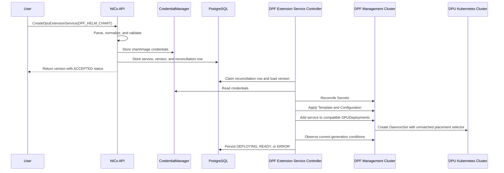

- Feature Name: dpf-helm-chart-extension-services
- Design Start: 1-July-2026
- Github Issue: [#3103](https://github.com/NVIDIA/infra-controller/issues/3103)

# Summary

[summary]: #summary

Today, extension services are deployed as local static pods by the DPU agent. That works for `KUBERNETES_POD`, but it does not use DPF's service lifecycle. For DPF-based sites, we want tenant-created extension services to be installed through DPF and then only run on the DPUs when tenant attaches them to instances.

This design adds a new DPU Extension Service type called `DPF_HELM_CHART`. The main idea is:

- A user creates a versioned extension service with a Helm chart reference and values.
- NICo installs that version once into each compatible shared `DPUDeployment`.
- The service does not run anywhere yet.
- When an instance attaches that service version, NICo adds a generated Node label to the selected `DPUDevice`s.
- DPF propagates that label into the DPU cluster.
- The chart's DaemonSet uses that label to run only on the selected DPU Nodes.

This keeps the existing extension-service API and lifecycle model, but moves the actual DPF Helm service reconciliation into the Site Controller.

Existing `KUBERNETES_POD` behavior should not change.

# Goals

- preserve the existing tenant-facing extension-service workflow;
- install a versioned Helm service once in each compatible shared DPUDeployment;
- activate that version only on DPUs selected for instances that request it;
- support private chart and image registries without exposing credentials;
- report per-DPU status through the existing instance status and lifecycle gates; and
- make create, attach, detach, and delete idempotent and recoverable.

The initial release does not support:

- arbitrary or unreviewed Helm charts;
- `DPUServiceInterface`, `DPUServiceNAD`, service-chain, PF, VF, or SF creation;
- BFB or DPUFlavor changes;
- disruptive Node Effects;

# Design Details

[implementation]: #implementation

This feature depends on the "Add Labels & Annotations from DPUDevic to V1.Node object for DPU" feature from DPF. See this [feature](https://redmine.mellanox.com/issues/4885907).

## RPC Change

### Service type

Add the enum value in forge.proto gRPC message:

```proto
enum DpuExtensionServiceType {
  KUBERNETES_POD = 0;
  DPF_HELM_CHART = 1;
}
```

The service type is immutable after creation.

### Create and update requests

```proto
message CreateDpuExtensionServiceRequest {
  // ===================== EXISTING FIELDS =========================
  // Metadata
  optional string service_id = 1; // If not provided, a new UUID will be generated
  string service_name = 2;
  optional string description = 3;
  DpuExtensionServiceType service_type = 4; // Immutable

  string tenant_organization_id = 5; // Immutable

  // Versioned extension service spec
  string data = 6;
  optional DpuExtensionServiceCredential credential = 7;

  // Metrics configuration to be added to the existing
  // metrics collection service that runs on the DPU.
  optional DpuExtensionServiceObservability observability = 8;

  // ===================== NEW FIELD ===============================
  repeated DpuExtensionServiceCredential dpf_helm_chart_credentials = 9;
}
```

#### Data

The existing `data` field remains the immutable, type-specific payload. This preserves the current gRPC, REST, Temporal, and database model.

For a `DPF_HELM_CHART` extension service, the tenant supplies `data` field as a JSON object containing the required chart definition. For example:
```json
{
  "repoURL": "oci://registry.example.com/charts",
  "chart": "tenant-chart",
  "chartVersion": "1.2.3",
  "imageRegistries": ["registry.example.com"],
  "values": {
    "image": {
      "repository": "registry.example.com/tenant/repo",
      "tag": "1.2.3"
    },
    "service": {
      "logLevel": "info"
    }
  }
}
```

| Field | Required | Meaning |
| --- | --- | --- |
| `repoURL` | Yes | Helm repo URL used by DPF / Argo CD. |
| `chart` | Yes | Chart name in the repo. |
| `chartVersion` | Yes | Pinned chart version.  |
| `imageRegistries` | No | List of registries that need image pull credentials. |
| `values` | No | Chart-specific Helm values for this immutable version. |

The tenant-supplied chart source and `values` belong in `DPUServiceTemplate` because they define the reusable service version. In the initial implementation, no tenant field maps into `DPUServiceConfiguration`. NICo creates the configuration because DPUDeployment requires both a template and a configuration, and sets only the generated `deploymentServiceName` and `upgradePolicy.applyNodeEffect: false` there. This keeps deployment policy under NICo control and prevents configuration values from overriding the protected template values.

NICo also generates the release name, DPF object names, placement selector, and image-pull Secret names. The selector and Secret name are merged into the template Helm values after validating that the tenant did not provide those reserved paths. They are intentionally absent from the tenant schema.

NOTE: A Helm chart acceptable for this feature must first satisfy the DPF requirements described in [DPUService Helm Chart](https://gitlab-master.nvidia.com/doca-platform-foundation/doca-platform-foundation/-/blob/main/docs/public/developer-guides/services/dpuservice-development.md?ref_type=heads#dpuservice-helm-chart). Those requirements define the baseline chart contract needed for DPF to render and manage the service correctly.

In addition to the DPF contract, NICo requires the chart to expose an `additionalNodeSelector`. The chart must support this value, but the tenant must not provide it in `data.values`. `additionalNodeSelector` is a NICo-reserved value: during reconciliation, NICo generates and injects the selector that limits the workload to DPU Nodes associated with instances to which the extension service is attached. Validation rejects a request whose tenant-supplied `values` contains `additionalNodeSelector`, preventing a tenant from weakening or replacing NICo's placement constraint.

#### Credentials

`DPF_HELM_CHART` type requires this new field because one helm chart may require a chart-repository credential and multiple credentials for image registries.

The old single `credential` field is enough for `KUBERNETES_POD`, but Helm services may need more than one credential:
- one chart repository credential
- zero or more image registry credentials

Therefore, a new field `dpf_helm_chart_credentials` is added to `CreateDpuExtensionServiceRequest` and a purpose field is added to `DpuExtensionServiceCredential`.

```proto
enum DpuExtensionServiceCredentialPurpose {
  DPU_EXTENSION_SERVICE_CREDENTIAL_PURPOSE_UNSPECIFIED = 0;
  DPU_EXTENSION_SERVICE_CREDENTIAL_PURPOSE_IMAGE_REGISTRY = 1;
  DPU_EXTENSION_SERVICE_CREDENTIAL_PURPOSE_CHART_REPOSITORY = 2;
}

message DpuExtensionServiceCredential {
  // ===================== EXISTING FIELDS =========================
  string registry_url = 1;

  oneof type {
    UsernamePassword username_password = 2;
  }

  // ===================== NEW FIELD ===============================
  DpuExtensionServiceCredentialPurpose purpose = 3;
}

message CreateDpuExtensionServiceRequest {
  // Fields 1-8 unchanged, including legacy optional credential = 7
  // ===================== NEW FIELD ===============================
  repeated DpuExtensionServiceCredential dpf_helm_chart_credentials = 9;
}

message UpdateDpuExtensionServiceRequest {
  // fields 1-7 unchanged, including legacy optional credential = 5
  // ===================== NEW FIELD ===============================
  repeated DpuExtensionServiceCredential dpf_helm_chart_credentials = 8;
}
```

- `credential` is still only for `KUBERNETES_POD`.
- `dpf_helm_chart_credentials` is only for `DPF_HELM_CHART`.
- Supplying both is invalid.
- A chart repo credential must match `data.repoURL`.
- Image registry credentials must match `data.imageRegistries`.
- Credentials are write-only. Read APIs only expose `has_credential`.

#### Request Validation

The API should reject the create request if:
- the tenant, service name, service type, or version checks fail;
- `data` is not valid JSON or has unknown top-level fields;
- `repoURL` is not `https://` or `oci://`, has embedded credentials, or is not allowed by site config;
- `chartVersion` is not pinned;
- `values` is too large or tries to set NICo-owned paths;
- credential purpose, endpoint, or duplicate checks fail.

The API does not download or render the chart in the request path. Chart review is an admin process. That process should run DPF schema validation, `helm lint`, rendered-resource review, privilege review, and a test for the NICo placement contract before the chart is added to the allow-list.

### Version deployment status

Creating a DPF Helm service version is asynchronous. A successful create API call means only that NICo validated and persisted the version; it does not mean the service has been added to the selected `DPUDeployment` objects or accepted by DPF.

Because of this, we need a version-level deployment status separate from the `InstanceDpuExtensionServiceStatus`. The `InstanceDpuExtensionServiceStatus` is aboue what happens after a version is attached to an instance. It tracks things like placement label propagation and whether the workload is ready on selected DPU. The version deployment status, on the other hand, tracks whether NICo has successfully registered the reusable service with DPF. This means NICo has reconciled the `DPUServiceTemplate`, `DPUServiceConfiguration`, and related Secrets, added them to every compatible `DPUDeployment.spec.services`, and DPF has accepted the current generated DPUService.

To support this, extend the existing protobuf message `DpuExtensionServiceVersionInfo` with an optional deployment status that includes a state and a redacted message.

For this status, `READY` means the service version is available to attach through its selected DPUDeployments. It does not mean that a workload Pod is already running on any DPU. The field is populated only for `DPF_HELM_CHART`, and older clients ignore it.

```proto
enum DpuExtensionServiceVersionDeploymentState {
  DPU_EXTENSION_SERVICE_VERSION_DEPLOYMENT_UNSPECIFIED = 0;
  DPU_EXTENSION_SERVICE_VERSION_ACCEPTED = 1;
  DPU_EXTENSION_SERVICE_VERSION_DEPLOYING = 2;
  DPU_EXTENSION_SERVICE_VERSION_READY = 3;
  DPU_EXTENSION_SERVICE_VERSION_ERROR = 4;
  DPU_EXTENSION_SERVICE_VERSION_DELETING = 5;
}

message DpuExtensionServiceVersionDeploymentStatus {
  DpuExtensionServiceVersionDeploymentState state = 1;
  string message = 2;
}

message DpuExtensionServiceVersionInfo {
  // Fields 1-5 unchanged

  // ===================== NEW FIELD ===============================
  optional DpuExtensionServiceVersionDeploymentStatus deployment_status = 6;
}
```

## Database Changes

The existing tables `extension_services` and `extension_service_versions` still store the service and immutable version data.

Two new DPF-specific tables are introduced: `dpf_extension_service_reconciliations` and `dpf_extension_service_attachments`.

### `dpf_extension_service_reconciliations`

One row per `DPF_HELM_CHART` service version. This table is the durable work item for the controller. 
The API inserts it in the same transaction as the version and uses `id` as the State Controller object ID. The initial values are `desired_state = 'ACTIVE'`, `deployment_state = 'ACCEPTED'`, and `next_reconcile_at = CURRENT_TIMESTAMP`.

```sql
CREATE TABLE dpf_extension_service_reconciliations (
    id                   UUID PRIMARY KEY DEFAULT gen_random_uuid(),
    service_id           UUID NOT NULL,
    service_version      VARCHAR(64) NOT NULL,

    dpf_service_name     VARCHAR(63) NOT NULL,

    desired_state        VARCHAR(16) NOT NULL DEFAULT 'ACTIVE',

    deployment_state     VARCHAR(16) NOT NULL DEFAULT 'ACCEPTED',
    status_message       VARCHAR(2048),

    reconcile_attempts   INTEGER NOT NULL DEFAULT 0,
    last_attempted_at    TIMESTAMPTZ,
    last_observed_at     TIMESTAMPTZ,
    next_reconcile_at    TIMESTAMPTZ NOT NULL DEFAULT CURRENT_TIMESTAMP,
    cleanup_completed_at TIMESTAMPTZ,

    created_at           TIMESTAMPTZ NOT NULL DEFAULT CURRENT_TIMESTAMP,
    updated_at           TIMESTAMPTZ NOT NULL DEFAULT CURRENT_TIMESTAMP,

    CONSTRAINT dpf_extension_service_reconciliations_version_fk
        FOREIGN KEY (service_id, service_version)
        REFERENCES extension_service_versions (service_id, version),
    CONSTRAINT dpf_extension_service_reconciliations_version_unique
        UNIQUE (service_id, service_version),
    CONSTRAINT dpf_extension_service_reconciliations_name_unique
        UNIQUE (dpf_service_name),
    CONSTRAINT dpf_extension_service_reconciliations_desired_state_check
        CHECK (desired_state IN ('ACTIVE', 'DELETING')),
    CONSTRAINT dpf_extension_service_reconciliations_deployment_state_check
        CHECK (deployment_state IN (
            'ACCEPTED', 'DEPLOYING', 'READY', 'ERROR', 'DELETING'
        )),
    CONSTRAINT dpf_extension_service_reconciliations_attempts_check
        CHECK (reconcile_attempts >= 0),
    CONSTRAINT dpf_extension_service_reconciliations_cleanup_check
        CHECK (
            cleanup_completed_at IS NULL
            OR desired_state = 'DELETING'
        )
);

CREATE INDEX dpf_extension_service_reconciliations_due_idx
    ON dpf_extension_service_reconciliations
       (next_reconcile_at, id)
    WHERE cleanup_completed_at IS NULL;
```

`desired_state` is written by API create/delete operations. All other mutable fields are written by the controller. The controller increments `reconcile_attempts` and updates `last_attempted_at` when an attempt begins. After observing DPF it updates `deployment_state`, the bounded and redacted `status_message`, `last_observed_at`, `next_reconcile_at`, and `updated_at`. `READY` rows remain periodically scheduled to detect drift; transient failures use backoff. The due-row index supports periodic discovery and restart recovery, while the existing `WorkLockManager` prevents concurrent reconciliation of the same `id`.

### `dpf_extension_service_attachments`

One row per targeted DPU machine for an instance/service version.

```sql
CREATE TABLE dpf_extension_service_attachments (
    instance_id                      UUID NOT NULL,
    dpu_machine_id                   UUID NOT NULL,
    service_id                       UUID NOT NULL,
    service_version                  VARCHAR(64) NOT NULL,

    extension_services_config_version VARCHAR(64) NOT NULL,
    instance_config_version           VARCHAR(64),

    placement_state                  VARCHAR(16) NOT NULL DEFAULT 'ACTIVE',
    deployment_state                 VARCHAR(16) NOT NULL DEFAULT 'PENDING',
    components                       JSONB NOT NULL DEFAULT '[]'::jsonb,
    status_message                   VARCHAR(2048),
    observed_at                      TIMESTAMPTZ,

    created_at                       TIMESTAMPTZ NOT NULL DEFAULT CURRENT_TIMESTAMP,
    updated_at                       TIMESTAMPTZ NOT NULL DEFAULT CURRENT_TIMESTAMP,

    CONSTRAINT dpf_extension_service_attachments_pk
        PRIMARY KEY (
            instance_id,
            dpu_machine_id,
            service_id,
            service_version
        ),
    CONSTRAINT dpf_extension_service_attachments_instance_fk
        FOREIGN KEY (instance_id) REFERENCES instances (id),
    CONSTRAINT dpf_extension_service_attachments_machine_fk
        FOREIGN KEY (dpu_machine_id) REFERENCES machines (id),
    CONSTRAINT dpf_extension_service_attachments_version_fk
        FOREIGN KEY (service_id, service_version)
        REFERENCES extension_service_versions (service_id, version),

    CONSTRAINT dpf_extension_service_attachments_placement_check
        CHECK (placement_state IN ('ACTIVE', 'REMOVING')),
    CONSTRAINT dpf_extension_service_attachments_deployment_check
        CHECK (deployment_state IN (
            'PENDING', 'RUNNING', 'TERMINATING',
            'TERMINATED', 'ERROR', 'UNKNOWN'
        )),
    CONSTRAINT dpf_extension_service_attachments_components_check
        CHECK (jsonb_typeof(components) = 'array')
);

CREATE INDEX dpf_extension_service_attachments_version_idx
    ON dpf_extension_service_attachments
       (service_id, service_version, placement_state);

CREATE INDEX dpf_extension_service_attachments_machine_idx
    ON dpf_extension_service_attachments
       (dpu_machine_id);
```

The controller inserts the row with `PENDING` before adding a label. It changes `deployment_state` only after observing the DPU, Node, and workload state. Detach or a selected-DPU-set change moves the row to `placement_state = 'REMOVING'`; the row remains until it reports `TERMINATED` and the corresponding instance-config tombstone is removed. The row can then be deleted. The foreign keys prevent the instance, DPU machine, or service version from being physically deleted while placement cleanup is still recorded.

This table ensures detach and instance deletion remove labels from every DPU ever targeted, not only the current network configuration.

We should not write DPF Helm observations into `machines.network_status_observation` as that is for `KUBERNETES_POD` type of extension service.

## Create service workflow

For `DPF_HELM_CHART` type services, `CreateDpuExtensionService` has a synchronous API phase and an asynchronous controller phase. The API validates and persists an immutable version and its reconciliation row; the Site Controller then materializes that desired state in DPF. External Kubernetes and credential operations therefore remain retryable without holding the API request open.



### API phase

For a valid request, the API handler:

1. Validates or creates the `ExtensionServiceId` and uses the initial `ConfigVersion` for the new service. When an update call is received, the API handler will use the next version.
2. Parses `data` into the new `carbide_dpf::types::DpfHelmChartServiceData` model proposed above and serializes the normalized JSON.
3. Validates and stores credentials using deterministic `CredentialManager` paths:
   ```text
   machines/extension-services/<service-id>/versions/<version>/chart-repository
   machines/extension-services/<service-id>/versions/<version>/image-registries/<sha256-registry-url>
   ```
4. In one PostgreSQL transaction:
   - inserts the `extension_services` record;
   - inserts `extension_service_versions` with normalized JSON and `has_credential`;
   - inserts a `dpf_extension_service_reconciliations` row with `desired_state = 'ACTIVE'` and `deployment_state = 'ACCEPTED'`; and
   - reserves the deterministic DPF service name through that row's unique `dpf_service_name` constraint.
5. Commits and enqueues the reconciliation `id`. Periodic due-row listing is the fallback if enqueueing is lost after commit.
6. Returns the normal `DpuExtensionService` response.

If the DB transaction fails after credentials were written, the handler should best-effort delete the credentials, following the existing compensation pattern.

### Controller phase

Following the existing controller pattern, add a `DpfExtensionServiceController` and start it from from `api-core::setup`. 

The controller is responsible for reconciling DPF Helm service versions with the DPF management cluster. The API only validates and stores the desired state. The controller does the external work, so Kubernetes, DPF, Argo CD, and credential operations can be retried safely if something fails. Therefore, the controller operations should be idempotent. Re-running the same reconciliation should be safe, whether the previous attempt finished, partially finished, or failed in the middle.

For each due row in `dpf_extension_service_reconciliations` with `desired_state = 'ACTIVE'`, the controller
1. Acquires a lock keyed by the reconciliation `id`, then re-reads the row so a concurrent delete cannot be missed.
2. Loads the service version, site DPF configuration, and purpose-qualified credentials.
3. Sets `deployment_state = 'DEPLOYING'`, increments `reconcile_attempts`, and records `last_attempted_at`.
4. Revalidates deployment availability, generated-object ownership, and DPUDeployment capacity.
5. Reconciles chart-repository and image-pull Secrets.
6. Applies the owned `DPUServiceTemplate` and `DPUServiceConfiguration`.
7. Adds the service entry to every compatible shared DPUDeployment using conflict retries.
8. Observes DPF and Argo CD conditions.
9. Atomically persists `READY`, `DEPLOYING` with a retry time, or `ERROR` with a redacted message.

The DPF service name and Node label are deterministic hashes of the full service UUID and version because the `DPUDeployment.spec.services` key and both `deploymentServiceName` fields are limited to 28 characters.
- DPF service name: `ext-<20-character-base32-hash>`
- Node label key: `carbide.nvidia.com/extsvc-<hash>`
- Node label value: `enabled`

#### Build DPF service resources

NICo does not build a `DPUService` directly. The controller parses `extension_service_versions.data`, builds the owned `DPUServiceTemplate` and `DPUServiceConfiguration`, and adds references to them under `DPUDeployment.spec.services`. DPF then generates and reconciles the resulting `DPUService`.

| Source | DPF destination |
| --- | --- |
| Generated service name | Template/configuration names, release name, both `deploymentServiceName` fields, and DPUDeployment service key |
| `repoURL` | `DPUServiceTemplate.spec.helmChart.source.repoURL` |
| `chart` | `DPUServiceTemplate.spec.helmChart.source.chart` |
| `chartVersion` | `DPUServiceTemplate.spec.helmChart.source.version` |
| Tenant `values` | Base of `DPUServiceTemplate.spec.helmChart.values` |
| Generated label | `helmChart.values.additionalNodeSelector` |
| Generated image Secret | Qualified chart's reserved `imagePullSecrets` value |
| Constant `false` | `DPUServiceConfiguration.spec.upgradePolicy.applyNodeEffect` |

For the example request, the generated resources are equivalent to:

```yaml
apiVersion: svc.dpu.nvidia.com/v1alpha1
kind: DPUServiceTemplate
metadata:
  name: ext-abc123
  namespace: dpf-operator-system
  labels:
    carbide.nvidia.com/extension-service-id: <service-uuid>
    carbide.nvidia.com/extension-service-version: <config-version>
spec:
  deploymentServiceName: ext-abc123
  helmChart:
    source:
      repoURL: oci://registry.example.com/charts
      chart: tenant-chart
      version: 1.2.3
      releaseName: ext-abc123
    values:
      image:
        repository: registry.example.com/tenant/repo
        tag: 1.2.3
      service:
        logLevel: info
      additionalNodeSelector:
        carbide.nvidia.com/extsvc-abc123: enabled
      imagePullSecrets:
        - name: ext-abc123-pull
---
apiVersion: svc.dpu.nvidia.com/v1alpha1
kind: DPUServiceConfiguration
metadata:
  name: ext-abc123
  namespace: dpf-operator-system
spec:
  deploymentServiceName: ext-abc123
  upgradePolicy:
    applyNodeEffect: false
```

For every supported deployment type, the controller resolves the configured DPUDeployment and merges only this entry:

```yaml
spec:
  services:
    ext-abc123:
      serviceTemplate: ext-abc123
      serviceConfiguration: ext-abc123
```

The update uses a resource-version precondition and conflict retry. It does not force-apply or replace the shared DPUDeployment. The controller re-reads the live object and enforces the CRD limit of 50 service entries before adding the key.

#### Why create produces no workload Pod

Creating the DPF resources makes the version available but does not attach it to an instance. A qualified chart combines:

- DPF's `serviceDaemonSet.nodeSelector`, selecting Nodes belonging to the DPUDeployment; and
- NICo's `additionalNodeSelector`, selecting Nodes belonging to instances requesting this version.

```yaml
affinity:
  nodeAffinity:
    requiredDuringSchedulingIgnoredDuringExecution:
      {{- toYaml .Values.serviceDaemonSet.nodeSelector | nindent 6 }}
nodeSelector:
  {{- toYaml .Values.additionalNodeSelector | nindent 2 }}
```

Before attachment, no DPU-cluster Node has the generated `carbide.nvidia.com/extsvc-*` label. A DaemonSet with no matching Nodes is therefore the expected post-create state, not a failure.

## Attach service version workflow

The existing RPC API continues to accept `(service_id, version)` entries through `InstanceDpuExtensionServicesConfig`. The API converts that protobuf message to the existing Rust model `InstanceExtensionServicesConfig`, stores it in `instances.extension_services_config`, and increments `instances.extension_services_config_version`.

For each active `DPF_HELM_CHART` service version attachment, the controller:

1. Uses the same `get_used_dpus` rule as the machine controller to find the instance's selected DPUs.
2. Writes durable target rows before changing external state.
3. Resolves each DPU machine ID to its DPUDevice and `DpuDeploymentType`.
4. Verifies that the version supports that deployment type and that shared DPF resources have no blocking error.
5. Checks the generated key against the selected DPUSet template's Node labels.
6. Adds only the generated key/value to `DPUDevice.spec.k8scluster.nodeLabels`, preserving all other keys.
7. Waits for DPF to copy the key to `DPU.spec.cluster.nodeLabels` and the corresponding DPU-cluster Node.
8. Observes the current DaemonSet Pod on that Node and writes config-versioned status.

`DPUDevice.spec.k8scluster.nodeLabels` is the name from the pending DPF API described in this design's dependency. It is not present in the currently vendored DPF CRD; the implementation must update the CRD and generated Rust type after DPF finalizes that field name and schema.

## Status and instance lifecycle

A shared DPUService/Argo CD Ready condition does not prove that a Pod is running on a particular DPU. Per-DPU state combines management-cluster readiness, label propagation, and DPU-cluster Pod readiness:

- `PENDING`: shared resources are not current-generation Ready, propagation is incomplete, or no current-revision Pod is Ready on the target Node.
- `RUNNING`: the DPU and Node have the desired label and a current-revision DaemonSet Pod is Ready on that Node.
- `TERMINATING`: placement is being removed but a DPU/Node label or matching Pod remains.
- `TERMINATED`: the labels are absent and no matching non-terminal Pod remains.
- `ERROR`: validation, ownership, collision, capacity, credential, DPF, Argo CD, or workload state has a non-transient failure.
- `UNKNOWN`: required state cannot be observed or the DPUDevice cannot be mapped to a Node.

Instance status should keep the two observation sources separate:

- DPU-agent observations for `KUBERNETES_POD`
- DB-backed DPF observations for `DPF_HELM_CHART`

## Update, detach, and delete workflows

Updating service data or credentials creates a new immutable version and reconciliation row. Existing instances stay on the previous version until explicitly updated. During an instance version change, the old attachment is marked removed and the new attachment is active until the old one reaches `TERMINATED`.

Detaching marks the attachment `removed`. The controller removes only that version's label from every DPUDevice it previously targeted, waits for labels and Pods to disappear, and reports `TERMINATED`. The machine controller then removes the tombstone without another config-version increment.

Deleting a service version is allowed only when no active or terminating instance references it. In one transaction, the API sets `desired_state = 'DELETING'`, `deployment_state = 'DELETING'`, and `next_reconcile_at = CURRENT_TIMESTAMP` on its reconciliation row. Instance validation immediately rejects new attachments to that version. The version remains readable with deployment status `DELETING` while the controller:

1. removes the service key from every compatible DPUDeployment;
2. waits for generated DPUService and Argo CD workloads to disappear;
3. deletes the owned configuration, template, and generated Secrets;
4. deletes source credentials from `CredentialManager`; and
5. sets `cleanup_completed_at`, soft-deletes the version, and soft-deletes the parent service if no active versions remain.

Source credentials remain available until generated resources are removed. Every step is idempotent and retryable after restart or dependency failure.

## Credential handling

Credentials are stored through `CredentialManager`, not in PostgreSQL:

```text
machines/extension-services/<service-id>/versions/<version>/chart-repository
machines/extension-services/<service-id>/versions/<version>/image-registries/<sha256-registry-url>
```

The secrets must not appear in any version data, helm values, logs etc.

The controller builds:

- an Argo CD repository Secret for the chart repo;
- a `kubernetes.io/dockerconfigjson` Secret for image pulls.


# Testing & QA

[qa]: #qa

Required tests include:

- Migration tests for both new tables, including foreign keys, state checks, uniqueness, JSON-array validation, and due/version indexes.
- Attachment-row grouping into `extension_services.dpf`, DPU-agent loading into `extension_services.dpu_agent`, service-type-based source selection, and matching/stale config-version handling.
- API JSON normalization, required/unknown fields, limits, reserved paths, allow-list, deployment types, credential purposes, duplicate endpoints, and legacy/new field exclusivity.
- Vault compensation when a database transaction fails.
- Version deployment status transitions and cloud REST status mapping.
- Exact input-to-DPUServiceTemplate/DPUServiceConfiguration mapping.
- Safe concurrent mutation of shared DPUDeployments and DPUDevices.
- BF3-only, BF4 Generic-only, and dual-compatible versions.
- DPUDeployment capacity and generated-name/ownership collisions.
- DPUDevice/DPUSet Node-label collision handling.
- Private HTTPS/OCI chart and image pulls.
- Create followed by immediate attach while shared resources are pending.
- Multiple instances sharing one version and one instance changing versions.
- Selected DPU-set changes without leaked labels or Pods.
- Detach, instance deletion, and asynchronous version deletion.
- Mixed `KUBERNETES_POD` and `DPF_HELM_CHART` config-version/status aggregation.
- Restart and DPF, Argo CD, DPU-cluster, Vault, and database outage recovery.
- No Node Effect, reboot, BFB/flavor change, reprovision, or readiness regression.
- Existing `KUBERNETES_POD` regression tests.

Definition of Done:

- [ ] A qualified DPF Helm version can be created, attached, updated, detached, and deleted through existing workflows.
- [ ] Workloads run only on selected DPUs for instances requesting that exact version.
- [ ] Operations are idempotent and recover after restart or dependency failure.
- [ ] Status correctly gates provisioning and deletion.
- [ ] Credentials are encrypted, redacted, and finalized in dependency order.
- [ ] Supported operations are non-disruptive.
- [ ] Existing extension-service behavior remains backward compatible.

# Operational Changes / Concerns

[operations]: #operations

The Site Controller needs management-cluster RBAC for DPUServiceTemplate, DPUServiceConfiguration, DPUService, DPUDeployment, DPUSet, DPU, DPUDevice, DPUCluster, and generated Secrets. DPU-cluster status access needs read-only permission for Nodes, Pods, DaemonSets, and ControllerRevisions.

A DPUDeployment permits at most 50 service entries, including mandatory services and every retained extension-service version. Metrics and alerts cover remaining capacity, reconcile failures/latency, label propagation, Pod readiness, stuck attachments, and credential cleanup.

Rollout order is DPF/CRD upgrade, NICo migrations with the controller disabled, chart qualification and RBAC, then site enablement and canary testing. Before rollback or disabling the controller, all DPF Helm attachments and versions must be removed so labels, resources, and Secrets are finalized.

# Drawbacks and alternatives

[drawbacks]: #drawbacks

- The workflow depends on PostgreSQL, Vault, DPF, Argo CD, and the DPU cluster.
- Every retained version consumes limited shared DPUDeployment capacity even while unattached.
- Modifying a shared DPUDeployment has a wider control-plane blast radius than a local static Pod.
- Charts implement both the DPF contract and NICo placement/image-pull values.
- Accurate per-DPU status requires DPU-cluster access and stable identity labels.
- Interfaces and disruptive service changes are not supported initially.

Alternatives considered:

- Keep only `KUBERNETES_POD`: simpler, but it bypasses DPF's service lifecycle.
- Create a DPUDeployment per instance: gives natural placement but duplicates shared deployment, firmware, and flavor configuration.
- Add/remove a shared service for every attachment: cannot target one instance's DPUs and creates unnecessary shared reconciliation and Node Effect risk.
- Hard-code the placement key in a chart: prevents safe reuse across service IDs and versions.

# Unresolved Questions

[unresolved-questions]: #unresolved-questions

- Which `repoURL` and chart pairs should be included in the initial administrative allow-list?
- Which DPF release contains the final DPUDevice Node-label API, and what is its exact field/schema?
- Does that release resolve the additional-selector readiness problem?
- What stable label or API maps a DPU-cluster Node to its DPUDevice and a rendered DaemonSet to its DPUService?
- Can DPF provide a least-privilege DPU-cluster observation kubeconfig instead of an admin kubeconfig?
- Is one site-managed credential per normalized Helm repository URL acceptable for the first release?
- Which charts, privileges, and image-signing policies are approved for the initial use case?

# Future Possibilities

[future-possibilities]: #future-possibilities

Future work can add administrator-defined interface profiles, service chains, richer observability, additional credential types, signed-chart enforcement, and planned disruptive upgrades. Native DPF support for targeting a DPUService to a subset of a DPUDeployment could eventually replace the chart-specific additional selector.
