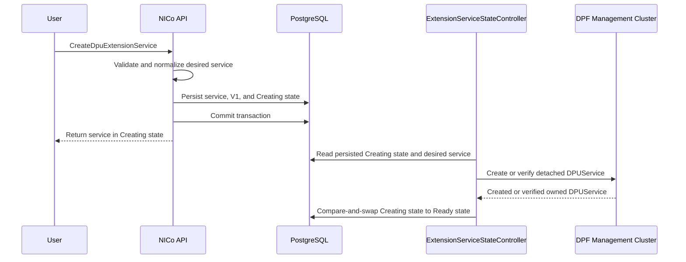

# DPU Extension Service Integration with DPF - Stage 1

GitHub Issue: [#3103](https://github.com/NVIDIA/infra-controller/issues/3103)

## 1. Revision History

| Version |    Date    | Modified By | Description     |
| :-----: | :--------: | ----------- | --------------- |
|   0.1   | 07/01/2026 | Felicity Xu | Initial version |
|   0.2   | 08/13/2026 | Felicity Xu | Revised version |

## 2. Summary

NICo currently supports DPU Extension Services of type `KUBERNETES_POD`. When a
`KUBERNETES_POD` extension service is attached to an instance, its pod spec is
sent to instance's DPUs through `GetManagedHostNetworkConfig`, and deployed
locally by the DPU agent as a static Kubernetes Pod.

However, as NICo transitions to DPF, extension services should use DPF to manage
workloads on DPUs rather than relying on direct deployment by the DPU agent.
This design introduces a new extension-service type, `DPF_HELM_CHART`, which
represents a Helm chart-based extension service managed through DPF.

A user creates a `DPF_HELM_CHART` service by providing a Helm chart reference
and values. The NICo API persists the desired service and its lifecycle state,
and the extension-service state controller asynchronously creates and manages
the corresponding detached `DPUService` CR. DPF then reconciles the associated
Argo CD Applications and the Kubernetes resources deployed by the `DPUService`.

For each `DPF_HELM_CHART` service, NICo generates and owns a stable,
service-specific `DPUService` Node selector and its corresponding placement
label. When the service is attached to an instance, NICo adds the matching label
to the `DPUDevice` for that instance's DPUs. DPF propagates the label
to the corresponding Nodes in the DPU cluster, where it satisfies the
`DPUService` DaemonSet selector and allows the workload to run only on the
selected DPUs.

### 2.1 Goals

The feature will be delivered in two stages.

**Stage 1 — DPF-managed service lifecycle and placement**

Stage 1 establishes the complete lifecycle for `DPF_HELM_CHART` extension
services with no network-interface configuration.

Stage 1 must:

- support the DPF-managed lifecycle of `DPF_HELM_CHART` extension services,
  with one detached DPF `DPUService` per extension service and durable,
  asynchronous reconciliation of create, update, and delete operations;
- support attaching and detaching an extension service through instance
  configuration, placing its workload only on the DPUs associated with attached
  instances through NICo-managed `DPUService` nodeSelector and placement
  labels, without interface-, service-chain-, VPC-, or other network-based
  configuration;
- update the stable DPF `DPUService` in place when an extension service’s Helm
  configuration changes, rolling the new chart revision to all DPUs of all
  currently attached instances without requiring reattachment;
- expose per-instance, per-DPU extension-service based on label placement result
  (The placement convergence status is only temporary, it will be replaced in
  Stage 2 with status from DPF per DPU per DPUService status when it's available);
- recover safely from transient DPF failures and NICo restarts, retrying
  unfinished DPUService lifecycle operations without losing the intended
  service state; and
- preserve existing `KUBERNETES_POD` extension-service API behavior, DPU-agent
  delivery, and status semantics.

**Stage 2 — Network-related service configuration**

Stage 2 extends the Stage 1 lifecycle and placement model with network
configuration.

Stage 2 must:

- allow a `DPF_HELM_CHART` extension service to be attached to a service VPC;
- support the DPF network resources and configuration required for that
  attachment, including DPU service interfaces and service chains;
- add observability configuration for `DPF_HELM_CHART` extension services; and
- derive instance DPF Helm extension-service status from DPF's per-DPU,
  per-`DPUService` workload-status API once it is available.

### 2.2 Future Improvements

1. **Per-DPUService namespace.** DPF does not currently support assigning a
   dedicated namespace to each `DPUService`. Stage 1 therefore creates all
   extension-service DPUService resources in `dpf-operator-system`. Revisit
   this when DPF provides per-DPUService namespace support.

2. **Additional DPUService contract overrides.** NICo exposes the placement
   selector plus the narrowly scoped DaemonSet fields documented in Section
   3.3.1. Other DPF contract fields remain unset. A future NICo API may expose
   more fields when a use case establishes their ownership and update rules.

## 3. Design

### 3.0 Helm Chart Requirements

A Helm chart supplied for `DPF_HELM_CHART` must satisfy the
[DPF DPUService contract](https://gitlab-master.nvidia.com/doca-platform-foundation/doca-platform-foundation/-/blob/main/docs/public/developer-guides/services/dpuservice-development.md?ref_type=heads#helm-chart-parameters).
It must expose every applicable DPF contract parameter as a Helm value and
render each value as required by that contract.

NICo always sets the `serviceDaemonSet.nodeSelector` DPF contract parameter.
It deterministically generates this field on the detached `DPUService` to
select the DPUs to which an extension service is attached. Tenant-provided
chart-specific `data.values` must not set
`serviceDaemonSet.nodeSelector`; NICo rejects that input because allowing it
would let a tenant bypass the placement contract.

The chart must render `serviceDaemonSet.nodeSelector` into its Pod template.
For example:

```yaml
spec:
  template:
    spec:
      {{- with .Values.serviceDaemonSet.nodeSelector }}
      affinity:
        nodeAffinity:
          requiredDuringSchedulingIgnoredDuringExecution:
            {{- toYaml . | nindent 12 }}
      {{- end }}
```

When the typed `data.serviceDaemonSet` object is present, NICo also sets its
labels, annotations, resources, and update strategy on the DPUService. The
Helm chart must provide appropriate defaults for every other DPF contract
parameter it relies on.

The optional `data.values` object remains available for tenant chart-specific
configuration. It cannot override NICo's node-selector value. Other values,
including a top-level `imagePullSecrets` value, are passed through to the
`DPUService` as tenant-provided chart configuration. NICo does not validate
referenced Secret names or create, update, rotate, or delete those Secrets. A
chart may instead define `imagePullSecrets` in its own `values.yaml` defaults.

When NICo creates a `DPF_HELM_CHART` extension service, it creates a detached
`DPUService` and deterministically generates
`DPUService.spec.serviceDaemonSet.nodeSelector` from the extension-service
UUID ([Section 3.3.3](#333-dpuservice-specification)). DPF exposes this
selector to the Helm chart as `.Values.serviceDaemonSet.nodeSelector`.

At this point, the selector does not match any target DPU, so the `DPUService`
can exist while its workload remains detached.

When the extension service is later attached to an instance, either during
instance creation or through `UpdateInstanceConfig`, NICo applies the matching
placement label to the `DPUDevice` resources for the instance's target DPUs.
DPF propagates those labels to the corresponding Nodes in the DPU cluster.

The Nodes then satisfy the selector rendered by the Helm chart, making the
service workload eligible to run on those DPUs. The detailed attachment and
`DPUDevice` label-reconciliation flow is described in
[Section 3.6.2](#362-label-placement-reconciliation).

### 3.1 Credential Pre-provisioning

Stage 1 uses externally pre-provisioned credentials. Before a tenant creates a
`DPF_HELM_CHART` extension service, an admin or launch workflow must create
and validate the required Kubernetes Secrets. NICo does not accept, store,
rotate, update, or delete DPF Helm-chart credentials.

- A private Helm-chart repository requires an Argo CD repository Secret in the
  namespace in which Argo CD runs, i.e. `argocd`.
- A private image registry requires a Secret
  in `dpf-operator-system`, labeled `dpu.nvidia.com/image-pull-secret` so DPF
  mirrors it to the target DPU clusters.
- A chart that needs a private image registry must render `imagePullSecrets`
  in its Pod template. The Secret name can come from the chart's `values.yaml`
  default or tenant-provided `data.values`; in either case, provisioning and
  ownership of the Secret remain external to NICo.

Credential availability is a launch/admin prerequisite, rather than an
eventually consistent setup step. DPF can create a DPUService and its Argo CD
Application while the corresponding repository Secret is absent, but Argo CD
then cannot fetch a private chart. Because Stage 1 reports placement-label
convergence rather than DPF workload health, that failure is not sufficient to
prevent a placement-ready service from being reported as `Running`.

### 3.2 Extension-Service State Controller

`ExtensionServiceStateController` uses NICo's existing state-controller
framework to reconcile the lifecycle of the detached DPF `DPUService` for a
`DPF_HELM_CHART` extension service. The controller is responsible only for
`DPUService` create, update and delete. Instance attachement and detachment
`DPUDevice` label synchronization and Stage 1 placement-status reporting are
handled by the existing instance lifecycle and status paths.

For `DPF_HELM_CHART` create, update, and delete operations, the API handlers
validate the request and persist the desired lifecycle state in the database.
The handlers do not call DPF directly. The controller's periodic scan discovers
the durable lifecycle rows and processes them asynchronously. It reads the
persisted service state, performs the required DPF operation outside a database
transaction, and records the resulting state transition. Periodic scans and
controller retries recover from transient DPF failure or a NICo restart.

The migration adds the standard state-controller fields to
`extension_services`:

```sql
ALTER TABLE extension_services
    ADD COLUMN controller_state JSONB,
    ADD COLUMN controller_state_version VARCHAR(64),
    ADD COLUMN controller_state_outcome JSONB DEFAULT NULL;
```

The migration also creates the extension-service state-history,
controller-iteration-ID, and queued-object tables required by the controller
framework. Existing live `KUBERNETES_POD` services are backfilled to `Ready`;
existing deleted services are backfilled to `Deleted`.

For `DPF_HELM_CHART` extension services,

- The controller states are `Creating`, `Ready`,
  `Updating`, `Deleting`, `Deleted`, and `Failed`;
- `controller_state_version` is independent of API-visible `version_ctr` and provides protection against
  stale controller iterations;
- `controller_state_outcome` stores the latest safe
  diagnostic; it is not desired service state.

The Core API exposes the lifecycle through the additive generic
`DpuExtensionService.lifecycle_status` field. The dedicated enum defines the
valid state names encoded in `LifecycleStatus.state`.

```proto
enum DpuExtensionServiceLifecycleState {
  DPU_EXTENSION_SERVICE_LIFECYCLE_STATE_CREATING = 0;
  DPU_EXTENSION_SERVICE_LIFECYCLE_STATE_READY = 1;
  DPU_EXTENSION_SERVICE_LIFECYCLE_STATE_UPDATING = 2;
  DPU_EXTENSION_SERVICE_LIFECYCLE_STATE_DELETING = 3;
  DPU_EXTENSION_SERVICE_LIFECYCLE_STATE_DELETED = 4;
  DPU_EXTENSION_SERVICE_LIFECYCLE_STATE_FAILED = 5;
}

message DpuExtensionService {
  // Existing fields 1 through 10.
  LifecycleStatus lifecycle_status = 11;
}
```

`LifecycleStatus.state` contains a JSON envelope such as
`{"state":"creating"}` or `{"state":"ready"}`. Both service types expose a
lifecycle status: a `KUBERNETES_POD` service is synchronously `Ready`, while a
`DPF_HELM_CHART` service reports its asynchronous controller state.

The REST API projects Core lifecycle state to its existing status model:
`Creating` becomes `Pending`, `Ready` remains `Ready`, `Updating` remains
`Updating`, `Deleting` and `Deleted` become `Deleting`, and `Failed` becomes
`Error`. After Core reaches `Deleted`, the service is omitted from inventory,
so REST clients normally observe it disappear rather than observe a terminal
`Deleted` status.

### 3.3 Create `DPF_HELM_CHART` Extension Service

`CreateDpuExtensionService` is responsible for accepting the request and
durably recording NICo's desired state. The handler validates the request,
persists the extension-service record and its initial `Creating` state in one
database transaction and commits it. The handler does not create DPF resources.

`ExtensionServiceStateController` is responsible for reconciling the persisted
intent with DPF. After it observes the committed `Creating` state, it reads the
desired service, creates or verifies the detached DPF `DPUService`, and records
the reconciliation outcome. Successful reconciliation transitions the service
from `Creating` to `Ready`.

The create response therefore means that NICo accepted the requested service;
it does not mean that DPF accepted the CR or that the Helm workload is healthy.
`Ready` means only that the desired DPUService CR has been reconciled.

The DPUService remains detached after creation. It is deployed only after a
later instance attachment causes NICo to apply the matching placement label to
the target `DPUDevice` resources.

The create workflow is:


```mermaid
sequenceDiagram
    participant User
    participant API as NICo API
    participant DB as PostgreSQL
    participant Controller as ExtensionServiceStateController
    participant DPF as DPF Management Cluster

    User->>API: CreateDpuExtensionService
    API->>API: Validate and normalize desired service
    API->>DB: Persist service, V1, and Creating state
    API->>DB: Commit transaction
    API-->>User: Return service in Creating state
    Controller->>DB: Read persisted Creating state and desired service
    Controller->>DPF: Create or verify detached DPUService
    DPF-->>Controller: Created or verified owned DPUService
    Controller->>DB: Compare-and-swap Creating state to Ready state
```

#### 3.3.1 API and Validation

The existing DPU Extension Service creation API is reused for `DPF_HELM_CHART`. The only type-level API change is the addition of `DPF_HELM_CHART = 1`:

```proto
enum DpuExtensionServiceType {
  KUBERNETES_POD = 0;
  DPF_HELM_CHART = 1;
}
```

The existing create request fields are reused and unchanged:

```proto
message CreateDpuExtensionServiceRequest {
  optional string service_id = 1;
  string service_name = 2;
  optional string description = 3;
  DpuExtensionServiceType service_type = 4;
  string tenant_organization_id = 5;
  string data = 6;
  optional DpuExtensionServiceCredential credential = 7;
  optional DpuExtensionServiceObservability observability = 8;
}
```

For `DPF_HELM_CHART`, the legacy `credential` field is not used and must be
unset. Helm-chart repository and image-registry credentials are externally
pre-provisioned as described in [Section 3.1](#31-credential-pre-provisioning);
NICo does not receive secret material in this API or persist it in Vault or
PostgreSQL.

The `service_name` is a NICo-facing display and lookup name. It will not be used as the `DPUService` name, Helm release name, or placement-label key. The current NICo database enforces name uniqueness per tenant organization, case-insensitively. Both `service_name` and `description` may be changed through
`UpdateExtensionServiceConfig`, as described in
[Section 3.4](#34-update-extension-service).

For `DPF_HELM_CHART`, `data` contains the mutable JSON service definition used
to construct and update the DPF `DPUService`. It includes the Helm chart source
and version, chart-specific Helm values, and other supported service
configuration.

Example input `data`:

```json
{
  "repoURL": "oci://registry.example.com/charts",
  "chartName": "tenant-service",
  "chartVersion": "1.2.3",
  "security.privileged": true,
  "serviceDaemonSet": {
    "labels": {
      "app.kubernetes.io/name": "tenant-service"
    },
    "annotations": {},
    "resources": {
      "nvidia.com/bf_sf": "1"
    },
    "updateStrategy": {
      "type": "RollingUpdate",
      "rollingUpdate": {
        "maxUnavailable": 1
      }
    }
  },
  "values": {
    "image": {
      "repository": "registry.example.com/tenant/service",
      "tag": "1.2.3"
    },
    "service": {
      "logLevel": "info"
    }
  }
}
```

| Field                 | Type      | Required | NICo validation and DPUService mapping                               |
| --------------------- | --------- | -------- | -------------------------------------------------------------------- |
| `repoURL`             | `string`  | Yes      | Helm repository URL beginning with `oci://` or `https://`; maps to `spec.helmChart.source.repoURL`. |
| `chartName`           | `string`  | Yes      | Qualified chart name; maps to `spec.helmChart.source.chart`.         |
| `chartVersion`        | `string`  | Yes      | Exact pinned chart version; maps to `spec.helmChart.source.version`. |
| `security.privileged` | `boolean` | Yes      | Service privilege policy; maps to `spec.security.privileged`.        |
| `serviceDaemonSet`    | `object`  | No       | Typed DaemonSet configuration; maps to `spec.serviceDaemonSet` alongside NICo's generated placement selector. |
| `values`              | `object`  | No       | Chart-specific Helm values; maps to `spec.helmChart.values` when present and is omitted from the projected CR when absent. |

The create API rejects a request when DPF is disabled for the site, `data` is
invalid, or required chart fields are missing. The JSON contract rejects
unknown fields. `serviceDaemonSet` supports only `labels`, `annotations`,
`resources`, and `updateStrategy`. Labels and annotations use Kubernetes
metadata syntax; annotations also retain Kubernetes' aggregate 256 KiB
key/value size limit. Resources are a Kubernetes
`ResourceList`: resource names map directly to quantity strings rather than to
container `requests` and `limits`. The update strategy accepts `RollingUpdate`
or `OnDelete`; rolling updates support `maxSurge` and `maxUnavailable` as
non-negative integers or percentage strings from `0%` through `100%`. After
Kubernetes defaults are applied, exactly one of the two values must be non-zero.
The legacy design spelling `upgradeStrategy`, all other fields, and an
explicit `serviceDaemonSet.nodeSelector` are rejected.

Validation is split by ownership. The REST layer checks the JSON wire shape,
required top-level request fields, unsupported fields, and NICo-owned
`nodeSelector` paths. Core is the canonical semantic boundary for both create
and update: it validates Kubernetes metadata, `ResourceList` quantities, and
DaemonSet update-strategy rules before normalized desired state is persisted.
The DPF SDK only converts that validated model into the DPUService type. NICo
does not currently apply DPUServiceConfiguration's 50-entry metadata cap or
reserved-key policy to direct DPUService metadata; the Core validator retains
a TODO for the reserved-key policy if DPF adds it to that contract.

Tenant-provided `values` must also not set
`serviceDaemonSet.nodeSelector`, which remains reserved for NICo's placement
contract. The typed `serviceDaemonSet` object and `values.serviceDaemonSet`
remain independent: compatible charts may continue consuming labels,
annotations, resources, and update strategy from chart values. Other chart
values, including `imagePullSecrets`, are passed through.
The launch/admin workflow, not this API, verifies that any referenced,
pre-provisioned Secrets exist before the service is created. The API also
rejects the legacy `credential` field and Stage 2 `observability` configuration
for this service type.

After validation, the API handler creates or validates the
`ExtensionServiceId` and opens a database transaction. In that transaction, it
persists the `extension_services` record, the normalized `data` in the initial
`extension_service_versions` row `V1`, and
`controller_state = Creating` with its initial `controller_state_version`.
The persisted state is the durable desired create operation; the handler does
not call DPF while the transaction is open or after it commits.

After the transaction commits, the handler returns the service in `Creating`
state. The response confirms that NICo accepted the create request, not that
DPF has accepted the DPUService or that its workload is healthy. The
controller's periodic scan subsequently reconciles the durable intent and also
recovers after a NICo restart.

#### 3.3.2 State Controller Create Reconciliation

`ExtensionServiceStateController` periodically discovers a `Creating` service,
reads its persisted desired state, and constructs the detached DPUService
described in [Section 3.3.3](#333-dpuservice-specification).

The controller does not create, read, update, rotate, or delete Helm
repository or image-pull Secrets in Stage 1. Their availability is an external
prerequisite described in [Section 3.1](#31-credential-pre-provisioning).

The controller calls `DpfOperations::create_dpu_service` outside a database
transaction. A successful create, or an `AlreadyExists` DPUService with the
expected NICo ownership and immutable identity, permits a compare-and-swap
transition from `Creating` to `Ready`. The transition succeeds only when
`controller_state_version` still matches the version read by that controller
iteration.

For example, a delete request may change the service to `Deleting` while a
create operation is in flight. The stale create iteration cannot overwrite
`Deleting` with `Ready` because its compare-and-swap transition fails. When the
controller transition loses the compare-and-swap check, it automatically
re-enqueues the service ID. The next iteration observes `Deleting` and performs
cleanup instead.

Transient DPF failures leave the service in `Creating` for retry. A DPF
configuration error, Kubernetes API `400` or `422` response, ownership
conflict, or immutable-specification conflict transitions it to `Failed`.
Other DPF API failures are retried. Exact DPF error details are logged; the
persisted controller outcome remains non-sensitive. Services in `Creating` or
`Failed` cannot be attached to an instance.

#### 3.3.3 DPUService Specification

For each `Creating` iteration, `ExtensionServiceStateController` reads desired
extension service information from the service's database row and projects it
into one detached `DPUService` spec.

The controller maps persisted and generated values as follows:

| NICo source or generated value                | DPUService field or behavior                                                             |
| --------------------------------------------- | ---------------------------------------------------------------------------------------- |
| Generated ext-svc name based on ext-svc UUID  | `metadata.name` and `spec.helmChart.source.releaseName`                                  |
| Service UUID                                  | `metadata.labels["nico/extension-service-id"]` for NICo ownership verification           |
| Management namespace                          | `metadata.namespace = dpf-operator-system`                                               |
| `data.repoURL`                                | `spec.helmChart.source.repoURL`                                                          |
| `data.chartName`                              | `spec.helmChart.source.chart`                                                            |
| `data.chartVersion`                           | `spec.helmChart.source.version`                                                          |
| `data.values`                                 | `spec.helmChart.values` when present; otherwise omitted                                 |
| `data.security.privileged`                    | `spec.security.privileged`                                                               |
| `data.serviceDaemonSet`                       | The supplied labels, annotations, resources, and update strategy in `spec.serviceDaemonSet` |
| Generated node selector based on ext-svc UUID | `spec.serviceDaemonSet.nodeSelector`                                                     |
| Stage 1 deployment model                      | `spec.deployInCluster = false` and no `serviceID`, interfaces, or config ports           |
| Stage 1 DPUCluster model                      | `spec.dpuClusterSelector` is unset; DPF creates an Application in every known DPUCluster |

NOTE: The `DPUService` name and node selector are deterministically derived from
the full, canonical extension-service UUID rather than from the mutable service
name. The implementation does not hash or truncate the UUID.
The Kubernetes resource name, Helm release name, and placement-label key are
therefore stable for the service lifetime.

- DPUService name: `extsvc-<service-uuid>`
- Node-label key/value: `nico/extsvc-<service-uuid>: enabled`

For a service with UUID `00000000-0000-0000-0000-000000000001` and the `data`
example in Section 3.3.1, NICo creates the following DPUService:

```yaml
apiVersion: svc.dpu.nvidia.com/v1alpha1
kind: DPUService
metadata:
  name: extsvc-00000000-0000-0000-0000-000000000001
  namespace: dpf-operator-system
  labels:
    nico/extension-service-id: 00000000-0000-0000-0000-000000000001
spec:
  deployInCluster: false
  security:
    privileged: true
  helmChart:
    source:
      repoURL: oci://registry.example.com/charts
      chart: tenant-service
      version: 1.2.3
      releaseName: extsvc-00000000-0000-0000-0000-000000000001
    values:
      image:
        repository: registry.example.com/tenant/service
        tag: 1.2.3
      service:
        logLevel: info
  serviceDaemonSet:
    labels:
      app.kubernetes.io/name: tenant-service
    annotations: {}
    resources:
      nvidia.com/bf_sf: "1"
    updateStrategy:
      type: RollingUpdate
      rollingUpdate:
        maxUnavailable: 1
    nodeSelector:
      nodeSelectorTerms:
        - matchExpressions:
            - key: nico/extsvc-00000000-0000-0000-0000-000000000001
              operator: In
              values: [enabled]
```

### 3.4 Update Extension Service

For `DPF_HELM_CHART`, an update is an asynchronous, in-place change to the
stable DPF `DPUService`. It does not create another attachable
`ConfigVersion`. The only active version remains `V1`, and every instance that
has the service attached receives the updated chart revision without an
`UpdateInstanceConfig` call or reattachment.

This differs from `KUBERNETES_POD`, where each data update creates a new
version so an instance configuration can select its old or new Pod
specification for a tenant-directed rollout. The existing `KUBERNETES_POD`
update behavior is unchanged.

#### 3.4.1 API Handler

`UpdateDpuExtensionService` retains its existing API shape:

```proto
message UpdateDpuExtensionServiceRequest {
  string service_id = 1;
  optional string service_name = 2;
  optional string description = 3;
  string data = 4;
  optional DpuExtensionServiceCredential credential = 5;
  optional int32 if_version_ctr_match = 6;
  optional DpuExtensionServiceObservability observability = 7;
}
```

For `DPF_HELM_CHART`, the update API handler first locks the service row and checks
`if_version_ctr_match`, when supplied, against the current `version_ctr`. A
Helm-data update is accepted only while the controller state is `Ready`; it is
rejected while the service is `Creating`, `Updating`, `Deleting`, `Deleted`,
or `Failed`. The legacy `credential` field and Stage 2 `observability`
configuration are rejected.

A non-empty `data` value is a **complete** replacement Helm-service
definition, not a DPUService or Kubernetes merge-patch document. It must
include every field required at creation, including the chart repository URL,
chart name, chart version, and security policy. `values` remains optional.

An empty `data` value together with a name or description change is a
metadata-only update. It does not require `Ready`, increment `version_ctr`,
change the lifecycle, or invoke DPF. It completes immediately after database
validation. A non-empty definition identical to the current normalized data is
rejected as a no-op.

For a Helm-data update, the API handler validates and normalizes the complete
desired service spec and:

1. updates the existing `V1` row with the desired normalized `data` and
   requested version-owned metadata;
2. applies requested service metadata;
3. increments `version_ctr`; and
4. transitions the controller state from `Ready` to `Updating` with a new
   `controller_state_version`.

After committing, the handler returns the service in `Updating` state. The
controller's periodic scan reconciles the durable desired revision. The
response means NICo accepted that revision; it does not mean DPF accepted the
patch or that a workload rollout completed.

#### 3.4.2 State Controller Update Reconciliation

`ExtensionServiceStateController` processes an `Updating` service from its
persisted desired `V1.data`. It constructs an internal Kubernetes merge patch
and calls `DpfOperations::patch_dpu_service` outside a database transaction.
The merge patch is an implementation detail, not a public API format.

Before patching, the controller gets the deterministically named DPUService
and verifies NICo ownership and immutable identity. The patch includes only
NICo-owned mutable fields: Helm source, Helm values,
and `security.privileged`. It does not change the DPUService name, Helm release
name, placement selector, or ownership label. NICo creates and verifies the
ownership label, but never patches it during an update.

When the persisted replacement definition changes `values` from present to
absent, the controller emits
`{"spec":{"helmChart":{"values":null}}}` in its internal JSON merge patch.
Per JSON merge-patch semantics, `null` removes the existing DPUService
`spec.helmChart.values` field; it does not retain the old values. DPF therefore
receives no values override and Helm uses the chart's `values.yaml` defaults.
This is distinct from supplying `values: {}`, which preserves an explicitly
empty values object. In particular, an omitted `values` object restores the
chart-owned `imagePullSecrets` default when the chart defines one.

After DPF accepts the patch, the controller transitions `Updating` to `Ready`
with a `controller_state_version` compare-and-swap transaction. A stale update
iteration cannot overwrite a later delete or update state; a failed
compare-and-swap is re-enqueued by the state-controller framework, and the
next iteration reads the winning state. `active_versions` continues to contain
only `V1`.

A transient DPF read or patch error leaves the service in `Updating` for retry.
A missing DPUService, ownership or immutable-specification conflict, DPF
configuration error, or Kubernetes API `400` or `422` response transitions the
service to `Failed`. The update path does not recreate a missing DPUService.

Note when DPF accepts an update, it reconciles the existing Argo CD Application in
each selected DPUCluster rather than creating a new Application for the chart
revision. The resulting rollout is asynchronous and non-atomic: DPUs can run
the old revision, the new revision, or a failed workload concurrently. DPF
does not automatically roll back an unhealthy Application; rollback means another
in-place update.

### 3.5 Delete Extension Service

#### 3.5.1 API Handler

DPF deletes a DPUService asynchronously: after accepting deletion, it can retain
the CR while finalizers remove the associated Argo CD Applications and related
resources. For `DPF_HELM_CHART`, an omitted version or `V1` identifies the
sole deployable service; any other version is rejected.

The handler locks the service and rejects deletion while it is referenced by an
active instance, or by a deleting instance whose extension-service cleanup is
incomplete. It accepts deletion from `Creating`, `Ready`, `Updating`, or
`Failed`. A repeat request while the service is `Deleting` is idempotently
accepted.

In one transaction, the handler soft-deletes the service and `V1`, and changes
the controller state to `Deleting` with a new `controller_state_version`. It
does not call DPF. After the transaction commits, it returns the normal delete
response; the controller's periodic scan reconciles the durable deletion
intent. The response means NICo accepted cleanup; it does not mean DPF has
deleted the DPUService.

The soft-deleted display name is reusable only after the state gets transitioned to `DELETED`.
A newly created service with that display name receives a new UUID, DPUService name, and placement-label key; it cannot refer to the deleted service.

#### 3.5.2 State Controller Delete Reconciliation

The controller processes a `Deleting` service by deriving its DPUService name
from the retained service ID and getting the DPUService. `NotFound` is success.
When the object exists, the controller verifies the NICo ownership label before
calling `DpfOperations::delete_dpu_service` outside a database transaction. An
ownership mismatch transitions the service to `Failed`; NICo must not delete an
unrecognized object.

An in-flight create or update DPF call can still complete after the delete
transaction commits. Its stale state transition cannot overwrite `Deleting`
because the controller-state compare-and-swap fails. The state-controller
framework re-enqueues the service, and the next iteration observes `Deleting`
and removes the deterministically named DPUService.

DPF can retain a successfully deleted DPUService with a deletion timestamp
until its finalizers have removed dependent resources. The controller therefore
continues to get the DPUService until it receives `NotFound`, then transitions
`Deleting` to `Deleted` through a `controller_state_version` compare-and-swap.
Transient get or delete failures leave the service in `Deleting` for retry.
This remains recoverable after a NICo restart because the soft-deleted service
record and controller state remain in PostgreSQL.

Stage 1 deletion does not delete the externally managed Argo CD repository
Secret, the image-pull Secret, or any source credential. Those Secrets may be
shared by other services and remain owned by the admin/launch workflow.

### 3.6 Attach Service to Instance

#### 3.6.1 Attachment to Instance API and Validation

An instance attaches extension services by including an
`InstanceDpuExtensionServicesConfig` in its `InstanceConfig`. The configuration
may be supplied when the instance is created or later through
`UpdateInstanceConfig`. Each entry identifies an extension service and its
selected version.

```proto
message InstanceConfig {
  ...
  optional InstanceDpuExtensionServicesConfig dpu_extension_services = 23;
}

message InstanceDpuExtensionServicesConfig {
  repeated InstanceDpuExtensionServiceConfig service_configs = 1;
}

message InstanceDpuExtensionServiceConfig {
  string service_id = 1;
  string version = 2;
}
```

`DPF_HELM_CHART` services have one attachable initial `ConfigVersion`, whose
logical version number is `V1`. An instance-configuration request must specify
the exact full version string returned by NICo, for example
`V1-T<created-at>`; the timestamp is part of `ConfigVersion` and
must match the stored `V1` row. The literal string `V1` alone is not a valid
attachment version. Helm-data updates are in place and do not create another
attachable version.

When extension services are present in `InstanceConfig`, the API handler
validates each requested service. A `DPF_HELM_CHART` service can be created
only when DPF is enabled for the site, and a new attachment requires a `Ready`
service on a DPF-managed host. `KUBERNETES_POD` services are not supported on
DPF-managed hosts. An instance cannot have `DPF_HELM_CHART` and
`KUBERNETES_POD` extension services at the same time, and it cannot list the
same service more than once.

The handler persists the instance extension service config. The actual labeling of `DPUDevice` is performed in instance state lifecycle.

#### 3.6.2 Label Placement Reconciliation

Label synchronization runs while the instance is in
`InstanceState::WaitingForExtensionServicesConfig`, where successful placement
gates initial instance readiness, and again during `InstanceState::Ready` to
repair placement drift and complete removals. A placement failure while the
instance is already `Ready` is logged and retried by a later controller scan;
it does not move the instance out of `Ready` or block unrelated Ready-state
work.

For each `DPF_HELM_CHART` service attached in persisted instance configuration,
the helper examines every physical DPU currently attached to the instance host
and determines the current target DPU set. Attachment neither creates another
DPUService nor changes the stable selector derived from the extension-service
UUID in Section 3.3.3.

Before attachment, no DPUDevice has the matching NICo-owned label. DPF can
therefore reconcile the detached DPUService and its per-DPUCluster
Applications while the chart workload remains absent from all DPUs. For every
physical DPUDevice, the helper merge-patches only the attached service's
NICo-owned key in `spec.cluster.nodeLabels`: it adds the matching UUID-derived
node-selector label (for example, `nico/extsvc-<service-uuid>: enabled`) on current
target DPUs, and removes that label from non-target DPUs and services marked
`removed`. It preserves labels owned by DPF and other controllers and performs
DPF calls outside database transactions.

DPF propagates the matching DPUDevice label to the DPU-cluster Node. The Node
then satisfies the DPUService selector and the qualified chart can schedule the
service workload on that DPU. NICo neither creates nor deletes workload Pods during attachment.

Label synchronization is idempotent: repeating it converges every physical
DPUDevice on the labels derived from current instance configuration. A DPF
error or temporarily unavailable DPUDevice blocks initial readiness and is
retried. Once the instance is already `Ready`, it is retried without changing
the instance state.

### 3.7 Instance Extension Service Status

#### 3.7.1 Stage 1: Placement Status

DPF does not currently provide a per-DPU, per-`DPUService` workload-status
API. Stage 1 therefore reports **placement convergence**, not Helm workload
health. The machine controller merge-patches a DPUDevice and then reads its
labels back. The resulting per-DPU service status describes that verified
placement state. For ordinary attachment and detachment, the required DPU set
is the instance's currently used DPUs. Instance deletion instead requires all
physical DPUs attached to the host.

| Stage 1 condition | Reported extension-service status | Meaning |
| --- | --- | --- |
| No current observation exists for the instance extension-service config version | `Unknown` | NICo has not yet observed this desired configuration; `configs_synced` is `Pending`. |
| An active target DPU is observed without the exact generated label and value | `Pending` | NICo has not yet established the requested placement. |
| An active target DPU is observed with the exact generated label and value | `Running` | The service is placement-ready: its selected Node can satisfy the generated selector. |
| A removed or untargeted service is observed with the generated label still present | `Terminating` | Label removal has not converged on that DPU. |
| A removed or untargeted service is observed without the generated label | `Terminated` | The service is placement-detached from that DPU. |
| A required DPUDevice patch or read fails | `Error` | NICo records the DPF failure for that DPU and retries during later reconciliation. |

The aggregate service status is derived from its required per-DPU statuses.
`Error` has precedence over `Unknown`, `Pending`, `Running`, `Terminating`, and
`Terminated`. `configs_synced` means that every required DPU has an observation
for the current extension-service configuration version; it can therefore be
`Synced` while a current observation reports `Error`. Initial instance
readiness additionally requires every active service to be `Running` and every
removed service to be `Terminated`.

For this Stage 1 contract, `Running` does **not** mean that the Helm workload
or its Pods are running, and `Terminated` does **not** prove that Pods have
been deleted. They mean only that NICo successfully attached or detached the
generated DPUDevice placement labels. The `Running` result is sufficient for
the existing extension-service readiness gate to declare initial placement
ready.

#### 3.7.2 Observation Storage

NICo stores extension-service observations in
`machines.extension_service_status_observations`, a type-keyed JSONB object.
Each value is an `InstanceExtensionServiceStatusObservation`; no
DPF-specific observation type or column is introduced.

- The `kubernetes_pod` entry is written from the DPU-agent report.
- The `dpf_helm_chart` entry is written by the machine controller from the
  Stage 1 label-placement result.

The object is separate from the agent-owned `network_status_observation`,
which the agent replaces as a whole. Each writer updates only its own service
type key, so KubernetesPod and DPF Helm observations cannot overwrite one
another. Instance-status derivation combines the type-keyed observations with
the persisted extension-service configuration.

#### 3.7.3 Stage 2: DPF Workload Status

When DPF provides a per-DPU, per-`DPUService` status API, NICo will use that
status for `DPF_HELM_CHART` services. The DPF observation will replace the
Stage 1 placement writer for the existing `dpf_helm_chart` key and continue to
use `InstanceExtensionServiceStatusObservation`; it will not introduce another
database column or a new observation model.

At that point, `Pending`, `Running`, `Terminating`, `Terminated`, `Error`, and
`Unknown` will represent DPF's actual service workload state on each DPU. A
missing, stale, or indeterminate DPF observation will be `Unknown` and will
not be sufficient to infer workload termination.

### 3.8 Detach Service

#### 3.8.1 Detachment API and Persisted Intent

An `UpdateInstanceConfig` request detaches a `DPF_HELM_CHART` service by
removing it from the requested active-service list. NICo retains the existing
service configuration in the persisted instance configuration with its
`removed` timestamp set; it does not remove it immediately.

The removed entry is the durable detachment intent. The API handler validates
and persists the configuration change but does not call DPF.

#### 3.8.2 DPUDevice Label Removal and Recovery

The label-reconciliation helper removes the service's generated label from
every physical `DPUDevice.spec.cluster.nodeLabels`, including target and
non-target DPUs. It uses the stable selector described in Section 3.6.2 and
preserves labels owned by DPF and other controllers. DPF calls occur outside
database transactions.

DPF propagates the removed label to the DPU-cluster Node. The Node no longer
matches the stable DPUService selector, so DPF reconciles removal of the
service workload. NICo does not delete Argo CD Applications or workload Pods
during instance detachment.

The removal operation is idempotent. For an instance's currently used DPUs, a
DPF error leaves the timestamped `removed` entry in place, reports `Error`, and
is retried by later Ready execution. Cleanup is also attempted on other
physical DPUs on the host, but a failure on one of those non-target DPUs does
not affect instance status or block detach completion; it is retried only while
the service entry remains in persisted instance configuration. An absent
DPUDevice is already clean for removal and is treated as success. These
failures do not move the instance out of `Ready` or block unrelated Ready-state
work.

#### 3.8.3 Stage 1 Termination Confirmation and Completion

For Stage 1, verified removal of the generated label from every currently used
DPUDevice records `Terminated` and completes ordinary detachment. NICo then
removes the timestamped `removed` entry from persisted instance configuration.
Until label removal converges on those required DPUs, the entry remains visible
as pending removal and prevents deletion of the referenced extension service.

This is deliberately a placement-detached completion contract, not proof that
the workload has stopped. In Stage 2, NICo will retain the removal entry and
wait for DPF to report `Terminated` for the service on every required DPU.

### 3.9 Instance Deletion

For Stage 1 instance deletion, NICo force-removes every DPF Helm placement
label from every physical DPU still attached to the host. DPF patch failures
are retried and keep deletion in progress. Successful removal from every
required DPUDevice is the Stage 1 `Terminated` result and allows instance
deletion to continue; it does not prove that the workload Pods are gone.

In Stage 2, instance deletion will instead wait for DPF to report `Terminated`
for every required DPUService/DPU pair after label removal has converged.

### 3.10 Design Invariants / Ownership Constraints

The following rules apply across the lifecycle described above:

1. One stable DPF `DPUService` belongs to one `DPF_HELM_CHART` extension
   service. Its management namespace, name, and placement-label key derive
   from the full extension-service UUID and remain stable across Helm
   revisions. NICo verifies the extension-service-ID ownership label and
   immutable placement fields before acting on an existing object.
2. NICo owns extension-service desired state, Helm-data validation and
   authorization, and instance attachment intent. DPF owns Argo CD
   Application and Helm workload reconciliation.
3. Instance configuration is the durable source of attachment intent.
   `DPUDevice.spec.cluster.nodeLabels` are derived placement state; NICo
   converges them idempotently and modifies only its generated
   extension-service label keys.
4. Tenant-cluster Node-label propagation is owned by DPF. NICo relies on it to
   make a DPUService eligible to run only on DPUs selected by an instance
   attachment.
5. DPUService CR acceptance, Node-label propagation, workload readiness, and
   workload absence are distinct states. A successful extension-service delete
   response means cleanup was accepted; it does not mean DPF has removed the
   DPUService or its workload.
6. In Stage 1, DPF Helm lifecycle decisions use the generated placement-label
   convergence contract, not aggregate DPUService or DPU-wide conditions. In
   Stage 2, they use DPF's per-DPU, per-`DPUService` workload status.
7. A physical DPU must not be an active Stage-1 target of two instances at the
   same time. If the platform cannot enforce this, durable per-DPU attachment
   state and label reference counting are required before launch.
8. `DPF_HELM_CHART` never flows through the DPU agent. NICo does not query
   tenant-cluster Pods directly for this service type.
9. Stage 1 DPF Helm credentials are external prerequisites. NICo never accepts
   their secret material through the extension-service API, writes it to Vault
   or PostgreSQL, or manages the corresponding Kubernetes Secrets. A private
   chart repository has one site-provisioned credential per canonical
   repository URL. Private-image charts may obtain `imagePullSecrets` from the
   chart's default values or from tenant-provided `data.values`, but the
   referenced Secret remains externally provisioned and managed.

## 4. Compatibility and Rollout

`KUBERNETES_POD` remains wire-compatible and retains numeric enum value `0`.
It continues to use versioned rows, credentials, DPU-agent configuration,
agent-side termination, and DPU-agent status.

`GetManagedHostNetworkConfig` sends only `KUBERNETES_POD` service
configurations, including removed configurations required for existing
agent-side termination. It never sends `DPF_HELM_CHART` data, credentials, or
removal markers to the DPU agent.

The database migration is additive. It backfills existing live
`KUBERNETES_POD` rows with the terminal `Ready` lifecycle state and deleted
rows with `Deleted`; existing instance configurations require no change. The
`type` column is already a string column and requires no database type
migration.

NICo must deploy a binary capable of decoding `dpf_helm_chart` before enabling
the capability gate. Old and new NICo binaries must not run concurrently after
the first `DPF_HELM_CHART` row is created. If rollout is paused, disable new
DPF Helm service creation and attachment while allowing the extension-service
state controller to clean up existing DPF resources.

## 5. Testing

Testing must cover:

- Creation of `DPF_HELM_CHART` in `Creating` state before DPF is called
- Extension-service controller create retry after a process restart and
  verified owned `AlreadyExists` results
- Migration/backfill of controller-state fields and lifecycle state exposure
- Helm data and reserved node-selector validation, plus use of a test chart
  that has been qualified separately against the DPUService contract
- Rejection of the legacy `credential` and Stage 2 `observability` fields for
  `DPF_HELM_CHART`
- Pass-through and chart-default `imagePullSecrets` behavior, plus verification
  that create, update, and delete do not manage externally pre-provisioned
  Secrets
- Deterministic resource generation and ownership verification
- In-place `UpdateDpuExtensionService` patching of the stable DPUService with
  no `UpdateInstanceConfig` or DPUDevice label change
- Optimistic-concurrency rejection, controller-state compare-and-swap,
  idempotent update retry, and ownership/specification conflict handling
- Delete superseding an in-flight create or update, with stale controller
  transition rejection and eventual DPUService deletion
- Stage 1 type-keyed extension-service observation persistence and
  placement-convergence status mapping
- Detached DPUService creation and deletion
- Delete acceptance persisting `Deleting` state before any DPF call
- Controller retry, restart recovery, and DPUService finalizer polling
- Refusal to mutate or delete a same-name DPUService with a mismatched
  extension-service ownership label
- Unmatched initial selector before attachment
- Attachment only to selected DPUs and label propagation
- Detach, selected-DPU-set changes, and removal cleanup only after generated
  label removal converges on every required DPU
- Instance deletion behavior
- Type-aware DPU-agent configuration exclusion
- Rejection when `KUBERNETES_POD` and `DPF_HELM_CHART` are attached to the
  same instance, plus preservation of each type's independent observation and
  delivery path
- Service deletion blocking while attachments remain, including deleting
  instances whose cleanup is incomplete
- Compatibility with existing `KUBERNETES_POD` behavior and capability-gate
  rollout
